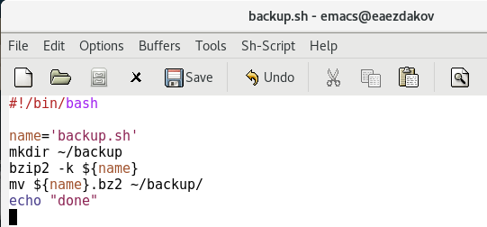
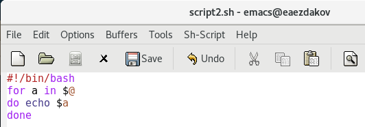
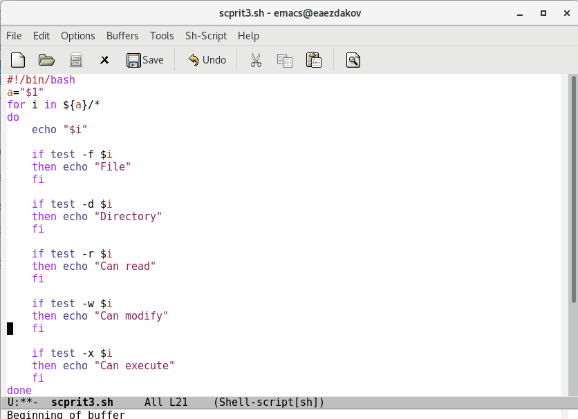
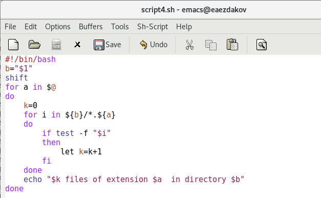

---
## Front matter
lang: ru-RU
title: Отчёт по лабораторной работе №11
author: Ездаков Егор Андреевич
institute: РУДН, Москва, Россия
date: 14 мая 2021

## Formatting
toc: false
slide_level: 2
theme: metropolis
header-includes: 
 - \metroset{progressbar=frametitle,sectionpage=progressbar,numbering=fraction}
 - '\makeatletter'
 - '\beamer@ignorenonframefalse'
 - '\makeatother'
aspectratio: 43
section-titles: true
---

## Цель работы

Изучить основы программирования в оболочке ОС UNIX/Linux. Научиться писать небольшие командные файлы.

## Задание 1

Написал скрипт, который при запуске будет делать резервную копию самого себя (то есть файла, в котором содержится его исходный код) в другую директорию backup в вашем домашнем каталоге. При написании скрипта использовал архиватор bzip2. (рис. -@fig:001).

{ #fig:001 width=70% }

## Задание 2

Написал пример командного файла, обрабатывающего любое произвольное число аргументов командной строки, в том числе превышающее десять.Например, скрипт может последовательно распечатывать значения всех переданных аргументов. (рис. -@fig:002).

{ #fig:002 width=70% }

## Заданиее 3

Написал командный файл − аналог команды ls (без использования самой этой команды и команды dir). Он должен выдавать информацию о нужном  каталоге и выводить информацию о возможностях доступа к файлам этого каталога (рис. -@fig:003).

{ #fig:003 width=70% }

## Задание 4

Написал командный файл, который получает в качестве аргумента командной строки формат файла и вычисляет количество таких файлов в указанной директории. Путь к директории также передаётся в виде аргумента командной строки (рис. -@fig:004).

{ #fig:004 width=70% }

## Вывод

В ходе выполнения данной лабораторной работы я изучил основы программирования в оболочке ОС UNIX/Linux и научился писать небольшие командные файлы

## {.standout}

Спасибо за внимание!