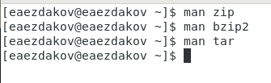
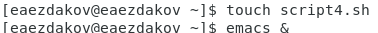

---
# Front matter
lang: ru-RU
title: "Отчёт по лабораторной работе №11"
subtitle: "Дисциплина: Операционные системы"
author: "Ездаков Егор Андреевич"

# Formatting
toc-title: "Содержание"
toc: true # Table of contents
toc_depth: 2
lof: true # List of figures
lot: true # List of tables
fontsize: 12pt
linestretch: 1.5
papersize: a4paper
documentclass: scrreprt
polyglossia-lang: russian
polyglossia-otherlangs: english
mainfont: PT Serif
romanfont: PT Serif
sansfont: PT Sans
monofont: PT Mono
mainfontoptions: Ligatures=TeX
romanfontoptions: Ligatures=TeX
sansfontoptions: Ligatures=TeX,Scale=MatchLowercase
monofontoptions: Scale=MatchLowercase
indent: true
pdf-engine: lualatex
header-includes:
  - \linepenalty=10 # the penalty added to the badness of each line within a paragraph (no associated penalty node) Increasing the value makes tex try to have fewer lines in the paragraph.
  - \interlinepenalty=0 # value of the penalty (node) added after each line of a paragraph.
  - \hyphenpenalty=50 # the penalty for line breaking at an automatically inserted hyphen
  - \exhyphenpenalty=50 # the penalty for line breaking at an explicit hyphen
  - \binoppenalty=700 # the penalty for breaking a line at a binary operator
  - \relpenalty=500 # the penalty for breaking a line at a relation
  - \clubpenalty=150 # extra penalty for breaking after first line of a paragraph
  - \widowpenalty=150 # extra penalty for breaking before last line of a paragraph
  - \displaywidowpenalty=50 # extra penalty for breaking before last line before a display math
  - \brokenpenalty=100 # extra penalty for page breaking after a hyphenated line
  - \predisplaypenalty=10000 # penalty for breaking before a display
  - \postdisplaypenalty=0 # penalty for breaking after a display
  - \floatingpenalty = 20000 # penalty for splitting an insertion (can only be split footnote in standard LaTeX)
  - \raggedbottom # or \flushbottom
  - \usepackage{float} # keep figures where there are in the text
  - \floatplacement{figure}{H} # keep figures where there are in the text
---

# Цель работы

Изучить основы программирования в оболочке ОС UNIX/Linux. Научиться писать небольшие командные файлы.

# Задание

1. Написать скрипт, который при запуске будет делать резервную копию самого себя (то есть файла, в котором содержится его исходный код) в другую директорию
backup в вашем домашнем каталоге. При этом файл должен архивироваться одним из архиваторов на выбор zip, bzip2 или tar. Способ использования команд
архивации необходимо узнать, изучив справку.
2. Написать пример командного файла, обрабатывающего любое произвольное
число аргументов командной строки, в том числе превышающее десять. Например, скрипт может последовательно распечатывать значения всех переданных
аргументов.
3. Написать командный файл — аналог команды ls (без использования самой этой
команды и команды dir). Требуется, чтобы он выдавал информацию о нужном
каталоге и выводил информацию о возможностях доступа к файлам этого каталога.
Кулябов Д. С. и др. Операционные системы 65
4. Написать командный файл, который получает в качестве аргумента командной
строки формат файла (.txt, .doc, .jpg, .pdf и т.д.) и вычисляет количество
таких файлов в указанной директории. Путь к директории также передаётся в
виде аргумента командной строки.

# Выполнение лабораторной работы

1. Выполнил задание 1.
   1. Для начала я изучил команды архивации, используя команды «man zip», «man bzip2», «man tar» (рис. -@fig:001).

   { #fig:001 }

   2. Далее я создал файл, в котором буду писать первый скрипт, и открыл
   его в редакторе emacs, используя клавиши «Ctrl-x» и «Ctrl-f» (команды
   «touch backup.sh» и «emacs &») (рис. -@fig:002).
   
   { #fig:002 }

   3. После написал скрипт, который при запуске будет делать резервную
копию самого себя (то есть файла, в котором содержится его исходный
код) в другую директорию backup в вашем домашнем каталоге. При написании скрипта использовал архиватор bzip2. (рис. -@fig:003).

   { #fig:003 }

   4. Проверил работу скрипта (команда «./backup.sh»), предварительно
добавив для него право на выполнение (команда «chmod +x *.sh»). Проверил, появился ли каталог backup/, перейдя в него (команда «cd backup/») посмотрел его содержимое (команда «ls») и просмотрел содержимое архива (команда «bunzip2 -c backup.sh.bz2») (рис. -@fig:004). (рис. -@fig:005).

   { #fig:004 }
   
   { #fig:005 }

2. Выолнил задание 2.

   1. Создал файл, в котором буду писать второй скрипт, и открыл его в
редакторе emacs, используя клавиши «Ctrl-x» и «Ctrl-f» (команды «touch
script2.sh» и «emacs &») (рис. -@fig:006).

   { #fig:006 }
   
   2. Написал пример командного файла, обрабатывающего любое произвольное число аргументов командной строки, в том числе превышающее десять.Например, скрипт может последовательно распечатывать значения всех переданных аргументов. (рис. -@fig:007).

   { #fig:007 }

   3. Проверил работу написанного скрипта (команда «./script2.sh 1 2 3 4 5 6 7 8 9 10 11»), предварительно добавив для него право на выполнение (команда «chmod +x *.sh»). (рис. -@fig:008).
   
   { #fig:008 }

3. Выполнил задание 3.

   1. Создал файл, в котором буду писать третий скрипт, и открыл его в
редакторе emacs, используя клавиши «Ctrl-x» и «Ctrl-f» (команды «touch
script3.sh» и «emacs &») (рис. -@fig:009).

   { #fig:009 }

   2. Написал командный файл − аналог команды ls (без использования самой этой команды и команды dir). Он должен выдавать информацию о нужном  каталоге и выводить информацию о возможностях доступа к файлам этого каталога (рис. -@fig:010).

   { #fig:010 }

   3. Далее проверил работу скрипта (команда «./script3.sh ~»), предварительно добавив для него право на выполнение (команда «chmod +x *.sh») (рис. -@fig:011).

   { #fig:011 }

4. Выполнил задание 4 

   1. Для четвертого скрипта также создал файл (команда «touch
script4.sh») и открыл его в редакторе emacs, используя клавиши «Ctrlx» и «Ctrl-f» (команда «emacs &») (рис. -@fig:012).

   { #fig:012 }

   2. Написал командный файл, который получает в качестве аргумента командной строки формат файла и вычисляет количество таких файлов в указанной директории. Путь к директории также передаётся в виде аргумента командной строки (рис. -@fig:013).

   { #fig:013 }

   3. Проверил работу написанного скрипта (команда «./script4.sh ~ sh»), предварительно добавив для него право на выполнение (команда «chmod +x *.sh») (рис. -@fig:014).

   { #fig:014 }

# Выводы

В ходе выполнения данной лабораторной работы я изучил основы программирования в оболочке ОС UNIX/Linux и научился писать небольшие командные файлы

