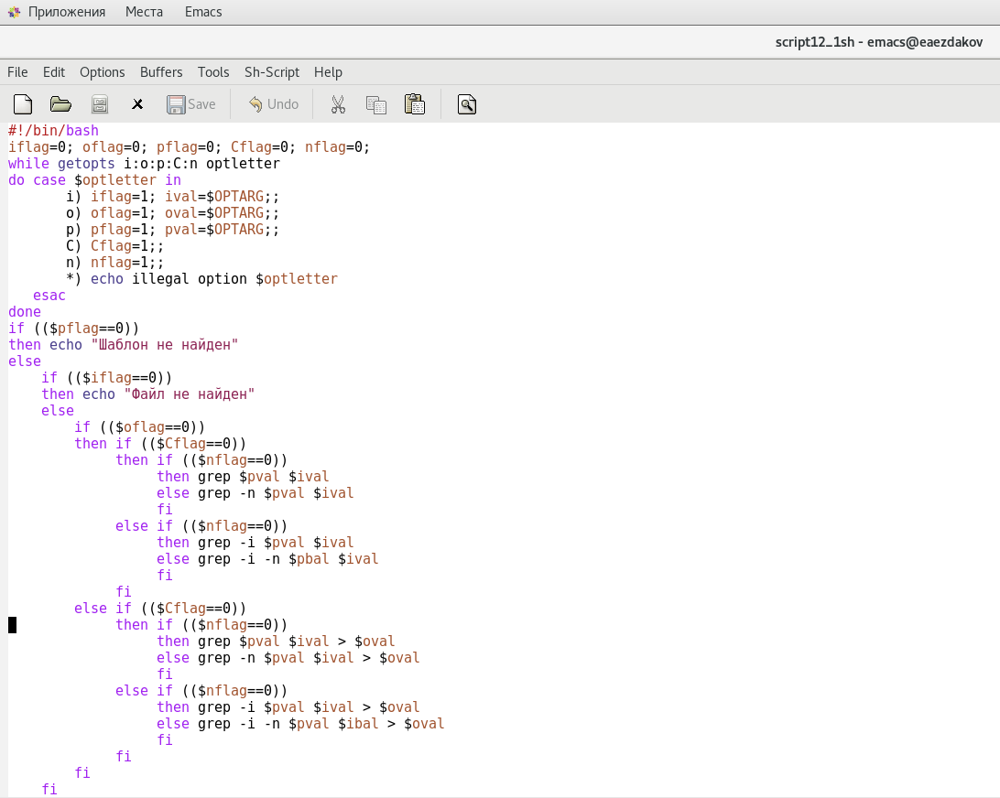
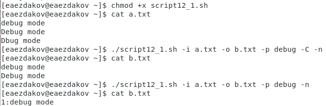
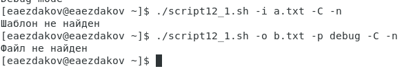
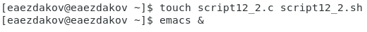
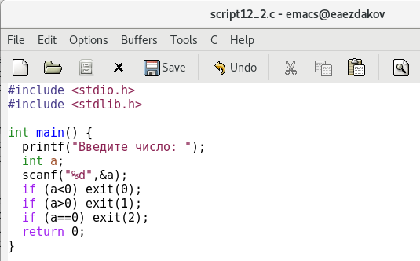
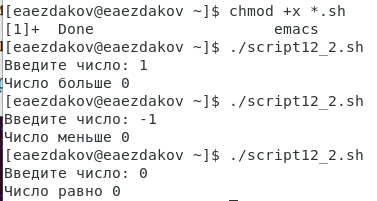
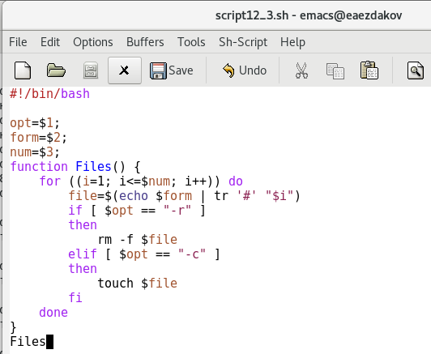
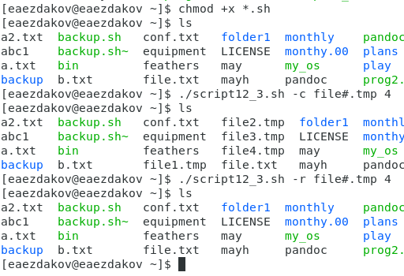
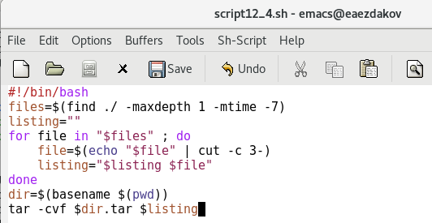
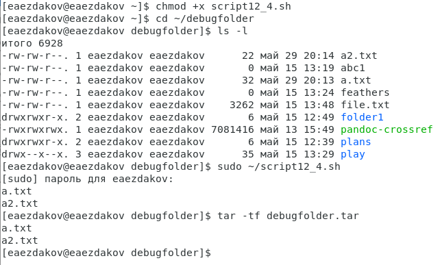

---
# Front matter
lang: ru-RU
title: "Отчёт по лабораторной работе №12"
subtitle: "Дисциплина: Операционные системы"
author: "Ездаков Егор Андреевич"

# Formatting
toc-title: "Содержание"
toc: true # Table of contents
toc_depth: 2
lof: true # List of figures
lot: true # List of tables
fontsize: 12pt
linestretch: 1.5
papersize: a4paper
documentclass: scrreprt
polyglossia-lang: russian
polyglossia-otherlangs: english
mainfont: PT Serif
romanfont: PT Serif
sansfont: PT Sans
monofont: PT Mono
mainfontoptions: Ligatures=TeX
romanfontoptions: Ligatures=TeX
sansfontoptions: Ligatures=TeX,Scale=MatchLowercase
monofontoptions: Scale=MatchLowercase
indent: true
pdf-engine: lualatex
header-includes:
  - \linepenalty=10 # the penalty added to the badness of each line within a paragraph (no associated penalty node) Increasing the value makes tex try to have fewer lines in the paragraph.
  - \interlinepenalty=0 # value of the penalty (node) added after each line of a paragraph.
  - \hyphenpenalty=50 # the penalty for line breaking at an automatically inserted hyphen
  - \exhyphenpenalty=50 # the penalty for line breaking at an explicit hyphen
  - \binoppenalty=700 # the penalty for breaking a line at a binary operator
  - \relpenalty=500 # the penalty for breaking a line at a relation
  - \clubpenalty=150 # extra penalty for breaking after first line of a paragraph
  - \widowpenalty=150 # extra penalty for breaking before last line of a paragraph
  - \displaywidowpenalty=50 # extra penalty for breaking before last line before a display math
  - \brokenpenalty=100 # extra penalty for page breaking after a hyphenated line
  - \predisplaypenalty=10000 # penalty for breaking before a display
  - \postdisplaypenalty=0 # penalty for breaking after a display
  - \floatingpenalty = 20000 # penalty for splitting an insertion (can only be split footnote in standard LaTeX)
  - \raggedbottom # or \flushbottom
  - \usepackage{float} # keep figures where there are in the text
  - \floatplacement{figure}{H} # keep figures where there are in the text
---

# Цель работы

Изучить основы программирования в оболочке ОС UNIX. Научится писать более сложные командные файлы с использованием логических управляющих конструкций и циклов.

# Задание

1. Используя команды getopts grep , написать командный файл, который анализирует командную строку с ключами:
- -iinputfile — прочитать данные из указанного файла;
- -ooutputfile — вывести данные в указанный файл;
- -pшаблон — указать шаблон для поиска;
- -C — различать большие и малые буквы;
- -n — выдавать номера строк.  
а затем ищет в указанном файле нужные строки, определяемые ключом -p.
2. Написать на языке Си программу, которая вводит число и определяет, является ли оно больше нуля, меньше нуля или равно нулю. Затем программа завершается с помощью функции exit(n), передавая информацию в о коде завершения в оболочку. Командный файл должен вызывать эту программу и, проанализировав с помощью команды $?, выдать сообщение о том, какое число было введено.
3. Написать командный файл, создающий указанное число файлов, пронумерованных последовательно от 1 до N (например 1.tmp, 2.tmp, 3.tmp, 4.tmp и т.д.). Число файлов, которые необходимо создать, передаётся в аргументы командной строки. Этот же командный файл должен уметь удалять все созданные им файлы (если они существуют).
4. Написать командный файл, который с помощью команды tar запаковывает в архив все файлы в указанной директории. Модифицировать его так, чтобы запаковывались только те файлы, которые были изменены менее недели тому назад (использовать команду find).

# Выполнение лабораторной работы

1. Используя команды getopts grep, написал командный файл, который анализирует командную строку с ключами:
- -iinputfile — прочитать данные из указанного файла;
- -ooutputfile — вывести данные в указанный файл;
- -pшаблон — указать шаблон для поиска;
- -C — различать большие и малые буквы;
- -n — выдавать номера строк,  
а затем ищет в указанном файле нужные строки, определяемые ключом –p.  
Для данной задачи я создал файл script12_1.sh и написал соответствующие скрипты (рис. -@fig:001).

{ #fig:001 }

Далее я проверил работу написанного скрипта, используя различные опции, предварительно добавив право на исполнение файла (команда «chmod +x *.sh») и создав 2 файла, которые необходимы для выполнения программы: a.txt и b.txt (рис. -@fig:002) (рис. -@fig:003). Скрипт работает корректно.

{ #fig:002 }

{ #fig:003 }

2. Написал на языке Си программу, которая вводит число и определяет, является ли оно больше нуля, меньше нуля или равно нулю. Затем программа завершается с помощью функции exit(n), передавая информацию о коде завершения в оболочку. Командный файл должен вызывать эту программу и, проанализировав с помощью команды $?, выдать сообщение о том, какое число было введено. Для данной задачи я создал 2 файла: script12_2.c и script12_2.sh (рис. -@fig:004) и написал соответствующие скрипты (рис. -@fig:005) (рис. -@fig:006).

{ #fig:004 }

{ #fig:005 }

{ #fig:006 }

Далее я проверил работу написанных скриптов (команда «./script12_2.sh»), предварительно добавив право на исполнение файла (команда «chmod +x *.sh») (рис. -@fig:007). Скрипты работают корректно.

{ #fig:007 }

3. Написал командный файл, создающий указанное число файлов, пронумерованных последовательно от 1 до N (например 1.tmp, 2.tmp, 3.tmp, 4.tmp и т.д.). Число файлов, которые необходимо создать, передаётся в аргументы командной строки. Этот же командный файл должен уметь удалять все созданные им файлы (если они существуют). Для данной задачи я создал файл: script12_3.sh и написал соответствующий скрипт (рис. -@fig:008).

{ #fig:008 }

Далее я проверил работу написанного скрипта (команда «./script12_3.sh»), предварительно добавив право на исполнение файла (команда «chmod +x *.sh»). Сначала я создал четыре файла (команда «./script12_3.sh –c file#.tmp 4»), удовлетворяющие условию задачи, а потом удалил их (команда «./script12_3.sh –r file#.tmp 4») (рис. -@fig:009). Скрипт работает корректно.

{ #fig:009 }

4. Написал командный файл, который с помощью команды tar запаковывает в архив все файлы в указанной директории. Модифицировала его так, чтобы запаковывались только те файлы, которые были изменены менее недели тому назад (использовать команду find). Для данной задачи я создал файл: script12_4.sh и написал соответствующий скрипт (рис. -@fig:010).

{ #fig:010 }

Далее я проверил работу написанного скрипта (команды «sudo ~/work/2020-2021/os-intro/laboratory/lab12/prog4.sh» и «tar -tf lab12.tar»), предварительно добавив право на исполнение файла (команда «chmod +x *.sh») (рис. -@fig:011). Скрипт работает корректно.

{ #fig:011 }

# Выводы

В ходе выполнения данной лабораторной работы я изучил основы программирования в оболочке ОС UNIX и научился писать более сложные командные файлы с использованием логических управляющих конструкций и циклов.
