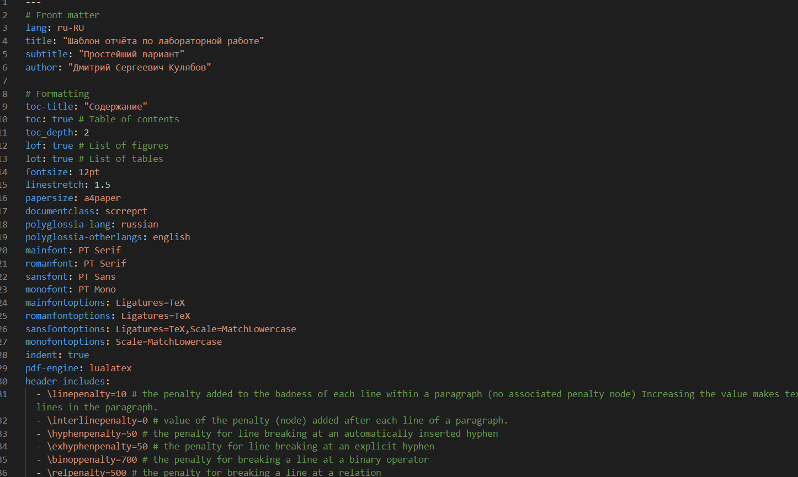

---
## Front matter
lang: ru-RU
title: Отчёт по лабораторной работе №3
author: Ездаков Егор Андреевич
institute: РУДН, Москва, Россия
date: 14 мая 2021

## Formatting
toc: false
slide_level: 2
theme: metropolis
header-includes: 
 - \metroset{progressbar=frametitle,sectionpage=progressbar,numbering=fraction}
 - '\makeatletter'
 - '\beamer@ignorenonframefalse'
 - '\makeatother'
aspectratio: 43
section-titles: true
---

## Цель работы

Научиться оформлять отчёты с помощью языка разметки Markdown.

## Задачи

Сделать отчёт по предыдущей лабораторной работе в формате Markdown

Преобразовать отчет в форматы pdf и docx

## Используем шаблом для отчета

{ #fig:001 width=70% }

## Используем синтаксис Markdown

{ #fig:002 width=70% }

## Заполняем титульный лист

{ #fig:003 width=70% }

## Работа с Markdown

Так как данная лабораторная работа строится на лабораторной работе №2, мы копируем основные моменты с прошлого отчёта (рис. -@fig:004).

{ #fig:004 width=70% }

## Оформляем скриншоты

Подписываем изображения
Обязательно указываем полную ссылку для каждого изображения при оформлении скриншота (рис. -@fig:005).

{ #fig:005 width=70% }

## Создание отчета в трёх форматах

С помощью makefile мы можем дополнительно создать два файла в формате pdf и docx (рис. -@fig:006).

{ #fig:006 width=70% }

## Вывод

Я научился оформлять отчеты к лабораторным работым в формате Markdown.

## {.standout}

Спасибо за внимание!