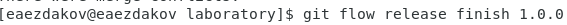

---
# Front matter
lang: ru-RU
title: "Отчёт по лабораторной работе №3"
subtitle: "Дисциплина: Операционные системы"
author: "Ездаков Егор Андреевич"

# Formatting
toc-title: "Содержание"
toc: true # Table of contents
toc_depth: 2
lof: true # List of figures
lot: true # List of tables
fontsize: 12pt
linestretch: 1.5
papersize: a4paper
documentclass: scrreprt
polyglossia-lang: russian
polyglossia-otherlangs: english
mainfont: PT Serif
romanfont: PT Serif
sansfont: PT Sans
monofont: PT Mono
mainfontoptions: Ligatures=TeX
romanfontoptions: Ligatures=TeX
sansfontoptions: Ligatures=TeX,Scale=MatchLowercase
monofontoptions: Scale=MatchLowercase
indent: true
pdf-engine: lualatex
header-includes:
  - \linepenalty=10 # the penalty added to the badness of each line within a paragraph (no associated penalty node) Increasing the value makes tex try to have fewer lines in the paragraph.
  - \interlinepenalty=0 # value of the penalty (node) added after each line of a paragraph.
  - \hyphenpenalty=50 # the penalty for line breaking at an automatically inserted hyphen
  - \exhyphenpenalty=50 # the penalty for line breaking at an explicit hyphen
  - \binoppenalty=700 # the penalty for breaking a line at a binary operator
  - \relpenalty=500 # the penalty for breaking a line at a relation
  - \clubpenalty=150 # extra penalty for breaking after first line of a paragraph
  - \widowpenalty=150 # extra penalty for breaking before last line of a paragraph
  - \displaywidowpenalty=50 # extra penalty for breaking before last line before a display math
  - \brokenpenalty=100 # extra penalty for page breaking after a hyphenated line
  - \predisplaypenalty=10000 # penalty for breaking before a display
  - \postdisplaypenalty=0 # penalty for breaking after a display
  - \floatingpenalty = 20000 # penalty for splitting an insertion (can only be split footnote in standard LaTeX)
  - \raggedbottom # or \flushbottom
  - \usepackage{float} # keep figures where there are in the text
  - \floatplacement{figure}{H} # keep figures where there are in the text
---

# Цель работы

Изучить идеологию и применение средств контроля версий

# Задание

Сделайте отчёт по предыдущей лабораторной работе в формате Markdown. В качестве отчёта просьба предоставить отчёты в 3 форматах: pdf, docx и md

# Выполнение лабораторной работы

1. Создал учетную запись на GitHub (рис. -@fig:001).

{ #fig:001 }

2. Настроил систему контроля версий git (рис. -@fig:002, рис. -@fig:003)

Сгенерировал ssh-ключ:

{ #fig:002 }

Добавил его в настройках учетной записи на GitHub

{ #fig:003 }

3. Создал структуру каталога лабораторных работ с помощью mkdir (рис. -@fig:004)

{ #fig:004 }

4. Создал репозиторий на GitHub. Назвал его os-intro (рис. -@fig:005):

{ #fig:005 }

5. Перешёл в каталог laboratory: cd

6. Инициализировал системы git (рис. -@fig:006):

{ #fig:006 }

7. Создал заготовку для файла README.md (рис. -@fig:007):

{ #fig:007 }

8. Создал первый коммит и отправил его на GitHub (рис. -@fig:008, рис. -@fig:009):

{ #fig:008 }

{ #fig:009 }

9. Добавил файл лицензии (рис. -@fig:010):

{ #fig:010 }

10. Просмотрел список имеющихся шаблонов игнорируемых файлов (рис. -@fig:011):

{ #fig:011 }

11. Загрузил шаблон для С (рис. -@fig:012):

{ #fig:012 }

12. Добавил новые файлы, отправил на GitHub (рис. -@fig:013, рис. -@fig:014):

{ #fig:013 }

{ #fig:014 }

13. Инициализировал git-flow (рис. -@fig:015):

{ #fig:015 }

14. Префикс для ярлыков установил в v (рис. -@fig:016):

{ #fig:016 }

15. Находясь на ветке develop, создал релиз с версией 1.0.0 (рис. -@fig:017, рис. -@fig:018):

{ #fig:017 }

{ #fig:018 }

16. Записал версию (рис. -@fig:019):

{ #fig:019 }

17. Добавил в индекс (рис. -@fig:020):

{ #fig:020 }

18. Залил релизную ветку в основную ветку (рис. -@fig:021):

{ #fig:021 }

19. Отправил данные на GitHub (рис. -@fig:022):

{ #fig:022 }

20. Создаем релиз на github. Для этого заходим в «Releases», нажимаем «Создать
новый релиз». Заходим в теги и заполняем все поля (создаём теги для версии 1.0.0).
После создания тега, автоматически сформируется релиз (рис. -@fig:023).

{ #fig:023 }

# Выводы

Я изучил идеологию и применение контроля версий.
