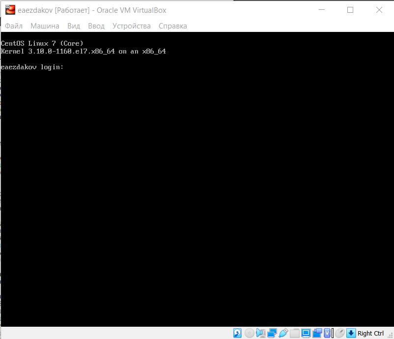
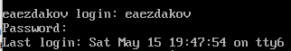
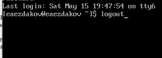
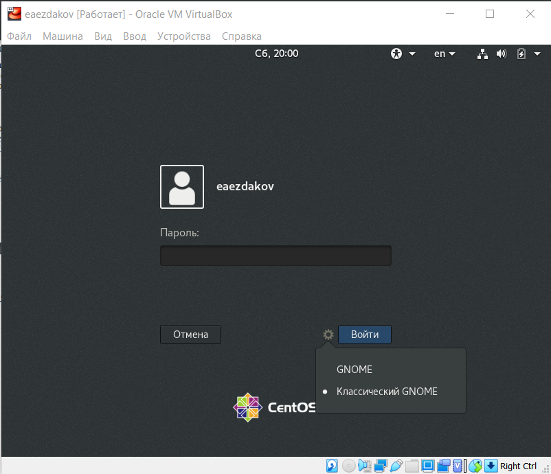
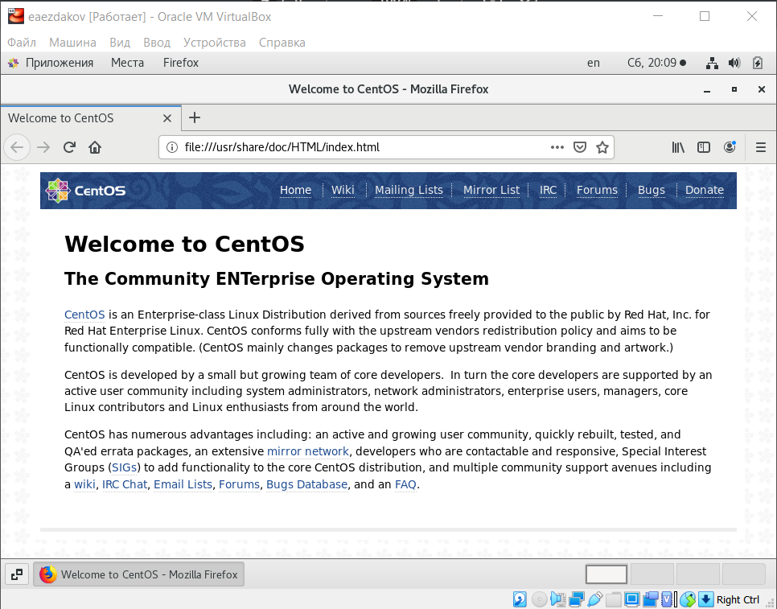
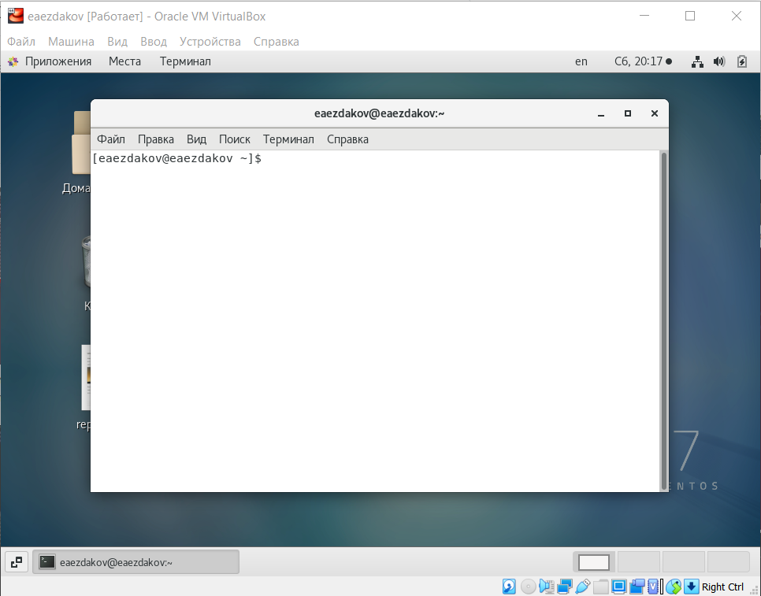

---
## Front matter
lang: ru-RU
title: Отчёт по лабораторной работе №4
author: Ездаков Егор Андреевич
institute: РУДН, Москва, Россия
date: 14 мая 2021

## Formatting
toc: false
slide_level: 2
theme: metropolis
header-includes: 
 - \metroset{progressbar=frametitle,sectionpage=progressbar,numbering=fraction}
 - '\makeatletter'
 - '\beamer@ignorenonframefalse'
 - '\makeatother'
aspectratio: 43
section-titles: true
---

## Цель работы

Познакомиться с операционной системой Linux, получить практические навыки работы с консолью и некоторыми графическими менеджерами рабочих столов операционной
системы.

## Работа с текстовыми консолями

На моей виртуальной машине 5 текстовых консолей
Чтобы запустить Ctr + Alt + Fn
Чтобы начать работу с консолью нужно зарегистрироваться 
Переключение между консолями и графическим режимом
Завершение работы logout или ctrl+d

{ #fig:001 width=70% }

{ #fig:002 width=70% }

{ #fig:003 width=70% }

## Менеджеры рабочих столов

На моей виртуальной машине 2 графических менеджера. По умолчанию установлен классический GNOME.

{ #fig:004 width=70% }

## Список установленных программ

На моей виртуальной машине установлены Текстовый редактор, Консоль и Браузер Firefox

{ #fig:005 width=70% }

{ #fig:006 width=70% }

{ #fig:007 width=70% }

## Вывод

Я познакомился с операционной системой Linux, получил практические навыки работы с консолью и некоторыми графическими менеджерами рабочих столов операционной
системы.

## {.standout}

Спасибо за внимание!