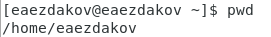
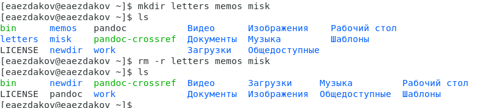
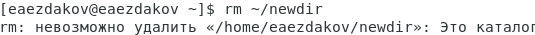
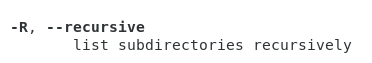
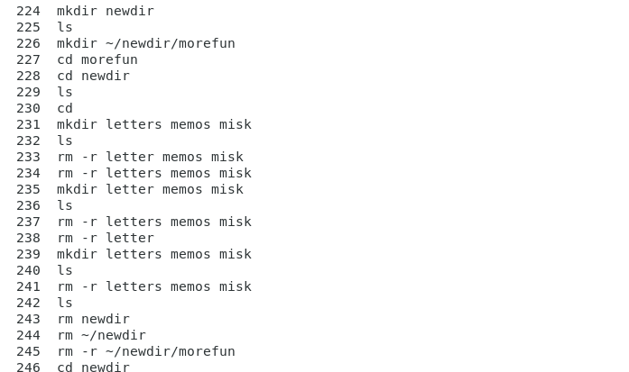
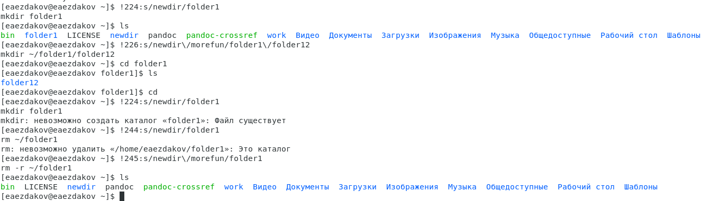

---
## Front matter
lang: ru-RU
title: Отчёт по лабораторной работе №5
author: Ездаков Егор Андреевич
institute: РУДН, Москва, Россия
date: 14 мая 2021

## Formatting
toc: false
slide_level: 2
theme: metropolis
header-includes: 
 - \metroset{progressbar=frametitle,sectionpage=progressbar,numbering=fraction}
 - '\makeatletter'
 - '\beamer@ignorenonframefalse'
 - '\makeatother'
aspectratio: 43
section-titles: true
---

## Цель работы

Приобретение практических навыков взаимодействия пользователя с системой посредством командной строки.

## Определяем полное имя домашнего каталога

Используем команду «pwd» (рис. -@fig:001).

{ #fig:001 width=70% }

## Переход в каталог /tmp

«ls» − выводится список видимых каталогов и файлов  
«ls -a» − к списку, описанному в предыдущем пункте, добавляются скрытые каталоги и файлы (их имена начинаются с точки)  
«ls -F» − с помощью этой команды получаем информацию о типах файлов  
«ls -l» − получаем список каталогов и файлов, но уже с более подробной информацией о них  
«ls -aFl» − данная команда отобразит список всех каталогов и файлов, в том числе и скрытых, с подробной информацией о них.

## Создание нескольких каталогов

Создаем каталоги letters, memos и misk (рис. -@fig:002). 
{ #fig:002 width=70% }

## Удаление каталога

Чтобы удалить каталог надо использовать команду rm с опцией -r

{ #fig:003 width=70% }

## Используем команду «man»

Определяем, какую опцию команды ls необходимо использовать, чтобы просмотреть содержимое не тольк указанного каталога, но и подкаталогов, входящих в него (рис. -@fig:004).

{ #fig:004 width=70% }

## История команд и модификация команд из буфера

Выведем историю команд с помощью команды «history» (рис. -@fig:05).

{ #fig:005 width=70% }
{ #fig:006 width=70% }

## Вывод

В ходе выполнения данной лабораторной работы я приобрёл практические навыки взаимодействия с системой посредством командной строки.

## {.standout}

Спасибо за внимание!