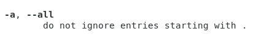

---
# Front matter
lang: ru-RU
title: "Отчёт по лабораторной работе №5"
subtitle: "Дисциплина: Операционные системы"
author: "Ездаков Егор Андреевич"

# Formatting
toc-title: "Содержание"
toc: true # Table of contents
toc_depth: 2
lof: true # List of figures
lot: true # List of tables
fontsize: 12pt
linestretch: 1.5
papersize: a4paper
documentclass: scrreprt
polyglossia-lang: russian
polyglossia-otherlangs: english
mainfont: PT Serif
romanfont: PT Serif
sansfont: PT Sans
monofont: PT Mono
mainfontoptions: Ligatures=TeX
romanfontoptions: Ligatures=TeX
sansfontoptions: Ligatures=TeX,Scale=MatchLowercase
monofontoptions: Scale=MatchLowercase
indent: true
pdf-engine: lualatex
header-includes:
  - \linepenalty=10 # the penalty added to the badness of each line within a paragraph (no associated penalty node) Increasing the value makes tex try to have fewer lines in the paragraph.
  - \interlinepenalty=0 # value of the penalty (node) added after each line of a paragraph.
  - \hyphenpenalty=50 # the penalty for line breaking at an automatically inserted hyphen
  - \exhyphenpenalty=50 # the penalty for line breaking at an explicit hyphen
  - \binoppenalty=700 # the penalty for breaking a line at a binary operator
  - \relpenalty=500 # the penalty for breaking a line at a relation
  - \clubpenalty=150 # extra penalty for breaking after first line of a paragraph
  - \widowpenalty=150 # extra penalty for breaking before last line of a paragraph
  - \displaywidowpenalty=50 # extra penalty for breaking before last line before a display math
  - \brokenpenalty=100 # extra penalty for page breaking after a hyphenated line
  - \predisplaypenalty=10000 # penalty for breaking before a display
  - \postdisplaypenalty=0 # penalty for breaking after a display
  - \floatingpenalty = 20000 # penalty for splitting an insertion (can only be split footnote in standard LaTeX)
  - \raggedbottom # or \flushbottom
  - \usepackage{float} # keep figures where there are in the text
  - \floatplacement{figure}{H} # keep figures where there are in the text
---

# Цель работы

Приобретение практических навыков взаимодействия пользователя с системой
посредством командной строки.

# Задание

1. Определите полное имя вашего домашнего каталога. Далее относительно
этого каталога будут выполняться последующие упражнения.
2. Выполните следующие действия:
    1. Перейдите в каталог /tmp.
    2. Выведите на экран содержимое каталога /tmp. Для этого используйте
  команду ls с различными опциями. Поясните разницу в выводимой на
  экран информации.
    3. Определите, есть ли в каталоге /var/spool подкаталог с именем cron?
    4. Перейдите в Ваш домашний каталог и выведите на экран его содержимое. Определите, кто является владельцем файлов и подкаталогов?
3. Выполните следующие действия:
    1. В домашнем каталоге создайте новый каталог с именем newdir.
    2. В каталоге ~/newdir создайте новый каталог с именем morefun.
    3. В домашнем каталоге создайте одной командой три новых каталога
    с именами letters, memos, misk. Затем удалите эти каталоги одной
    командой.
    4. Попробуйте удалить ранее созданный каталог ~/newdir командой rm.
    Проверьте, был ли каталог удалён.
    5. Удалите каталог ~/newdir/morefun из домашнего каталога. Проверьте,
    был ли каталог удалён.
4. С помощью команды man определите, какую опцию команды ls нужно
6
использовать для просмотра содержимое не только указанного каталога,
но и подкаталогов, входящих в него.
5. С помощью команды man определите набор опций команды ls , позволяющий отсортировать по времени последнего изменения выводимый список
содержимого каталога с развёрнутым описанием файлов.
6. Используйте команду man для просмотра описания следующих команд: cd,
pwd, mkdir, rmdir, rm. Поясните основные опции этих команд.
7. Используя информацию, полученную при помощи команды history, выполните модификацию и исполнение нескольких команд из буфера команд

# Выполнение лабораторной работы

1. Определяем полное имя домашнего каталога, используя команду «pwd»
(рис. -fig:001)

{ #fig:001 }

2.
    1. Переходим в каталог /tmp, используя команду «cd /tmp» (рис. -@fig:002).
    
    2. Выводим на экран содержимое каталога /tmp, используя команду «ls»
    с различными опциями (рис. -@fig:003) (рис. -@fig:004) (рис. -@fig:005) (рис. -@fig:006):
    
    «ls» − выводится список каталогов и файлов, которые можно увидеть,«вручную» открыв каталог tmp
    
    «ls -a» − к списку, описанному в предыдущем пункте, добавляются
    скрытые каталоги и файлы (их имена  начинаются с точки)
    
    «ls -F» − с помощью этой команды получаем информацию о типах
    файлов
    
    «ls -l» − получаем список каталогов и файлов, но уже с более подробной
    информацией о них
    
    «ls -aFl» − данная команда отобразит список   всех каталогов и файлов, в
    том числе и скрытых, с подробной информацией о них.

{ #fig:002 }
    
{ #fig:003 }

{ #fig:004 }

{ #fig:005 }

{ #fig:006 }

  3. Чтобы определить, есть ли в каталоге /var/spool подкаталог с именем cron,
  перейдем в указанный каталог с помощью команды «cd /var/spool», просмотрим его содержимое, используя команду «ls», и таким образом убедимся,
  что данный подкаталог существует (рис. -@fig:007).

{ #fig:007 }

  4. Далее перехожу в свой домашний каталог с помощью команды «cd ~» и, используя команду «ls -aFl», вывожу на экран его содержимое. Из (рис. -@fig.008)
  видно, что владельцем всех каталогов и файлов, кроме родительского каталога (его владелец пользователь root из группы пользователей root), является пользователь daavetisyan из группы пользователей daavetisyan.

{ #fig:008 }

3.
    1. В домашнем каталоге создаем новый каталог newdir, используя команду «mkdir newdir» (рис. -@fig.009). Убеждаемся, что каталог создан, с
    помощью команды «ls».

{ #fig:009 }

  2. Cоздаем каталог morefun, используя команду «mkdir ~/newdir/morefun»,
  после чего командой «cd newdir» переходим в ранее созданный каталог и
  там командой «ls» проверяем правильность выполненных действий (рис.
  -@fig.010).

{ #fig:010 }

  3. Используя команду «mkdir letters memos misk», создаем в домашнем каталоге три новых каталога. Далее с помощью команды «rm –r letters memos misk» удаляем созданные каталоги (рис. -@fig.011). Командой «ls» проверяем правильность выполненных действий.

{ #fig:011 }

  4. Пробуем удалить каталог newdir командой «rm newdir». Получаем отказ в
  выполнении команды (т.к. данный каталог содержит подкаталог morefun и
  требуется при удалении использовать опцию -r) (рис. -@fig.012).

{ #fig:012 }

  5. Удаляем каталог newdir/morefun, используя команду «rm –r newdir/morefun». Командой «ls» проверяем правильность выполненного действия (рис.
  -@fig.013).

{ #fig:013 }

4. Используя команду «man ls», определяю, какую опцию команды ls необходимо использовать, чтобы просмотреть содержимое не тольк указанного
каталога, но и подкаталогов, входящих в него (рис. -@fig.014).

{ #fig:014 }

5. Используя то же руководство по команде «ls», открытое в предыдущем пункте, определяю набор опций команды ls, позволяющий отсортировать по
времени последнего изменения выводимый список содержимого каталога с развернутым описанием файлов (рис. -@fig.015) (рис. -@fig.016) (рис.
-@fig.017).

{ #fig:015 }

{ #fig:016 }

{ #fig:017 }

6. Используя команды «man cd», «man pwd», «man mkdir», «man rmdir», «man
rm», просматриваю описание соответствующих команд. Команда cd не имеет дополнительных опций.

Команда pwd (рис. -@fig.018):

-L, –logical - не разыменовывать символические ссылки. Если путь содержит символические ссылки, то выводить их без преобразования в исходный путь;
-P, –physical - преобразовывать (отбрасывать символические ссылки) символические ссылки в исходные имена. Если путь содержит символические ссылки,
то они будут преобразованы в названия исходных директорий, на которые они указывают;

–help - показать справку по команде pwd;

–version - показать версию утилиты pwd.

{ #fig:018 }

Команда mkdir (рис. -@fig.019):

-m, –mode=MODE - устанавливает права доступа для создаваемой директории.
Синтаксис MODE такой же как у команды chmod;
-p, –parents - создать все директории, которые указаны внутри пути. Если какаялибо директория существует, то предупреждение об этом не выводится;
-v, –verbose - выводить сообщение о каждой создаваемой директории;
-z - установить контекст SELinux для создаваемой директории по умолчанию;
–context=CTX - установить контекст SELinux для создаваемой директории в значение CTX;
–help - показать справку по команде mkdir;
–version - показать версию утилиты mkdir.

{ #fig:019 }

Команда rmdir (рис. -@fig.020):

–ignore-fail-on-non-empty - игнорировать директории, которые содержат в себе
файлы;
-p, –parents - в этой опции каждый аргумент каталога обрабатывается как путь,
из которого будут удалены все компоненты, если они уже пусты, начиная с последнего компонента;
-v, –verbose - отображение подробной информации для каждого - обрабатываемого каталога;
–help - показать справку по команде rmdir;
–version - показать версию утилиты rmdir.

{ #fig:020 }

Команда rm (рис. -@fig.021):

-f, –force - игнорировать несуществующие файлы и аргументы. Никогда не выдавать запросы на подтверждение удаления;
-i - выводить запрос на подтверждение удаления каждого файла;
-I - выдать один запрос на подтверждение удаления всех файлов, если удаляется
больше трех файлов или используется рекурсивное удаление.
Опция применяется, как более «щадящая» версия опции –i;
–interactive=WHEN - вместо WHEN можно использовать: never — никогда не выдавать запросы на подтверждение удаления.
once — выводить запрос один раз (аналог опции -I).
always — выводить запрос всегда (аналог опции -i).
Если значение КОГДА не задано, то используется always;
–one-file-system - во время рекурсивного удаления пропускать директории, которые находятся на других файловых системах;
–no-preserve-root - если в качестве директории для удаления задан корневой
16
раздел /, то считать, что это обычная директория и начать выполнять удаление;
–preserve-root=all - если в качестве директории для удаления задан корневой
раздел /, то запретить выполнять команду rm над корневым разделом. Данное
поведение используется по умолчанию;
-r, -R, –recursive - удаление директорий и их содержимого. Рекурсивное удаление;
-d, –dir - удалять пустые директории;
-v, –verbose - выводить информацию об удаляемых файлах;
–help - показать справку по команде rm;
–version - показать версию утилиты rm.

{ #fig:021 }

7. Выведем историю команд с помощью команды «history» (рис. -@fig.022).
Далее, используя команды, указанные на рисунках, создадим каталог folder1,
в нём создадим подкаталог folder12, попробуем удалить каталог
folder1, используя rm, и удалим каталог folder1 при помощи команды rm (рис.
-@fig.023).

{ #fig:022 }

{ #fig:023 }

# Выводы

В ходе выполнения данной лабораторной работы я приобрёл практические навыки взаимодействия с системой посредством командной строки.

