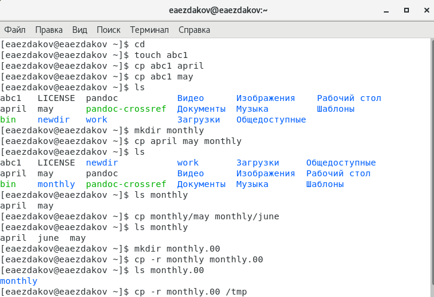
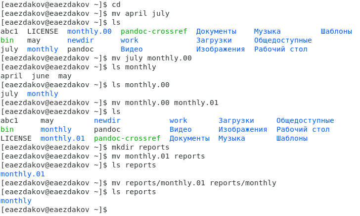
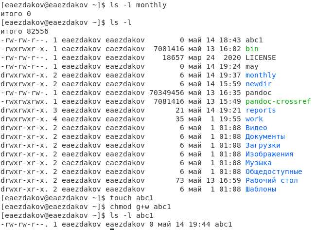
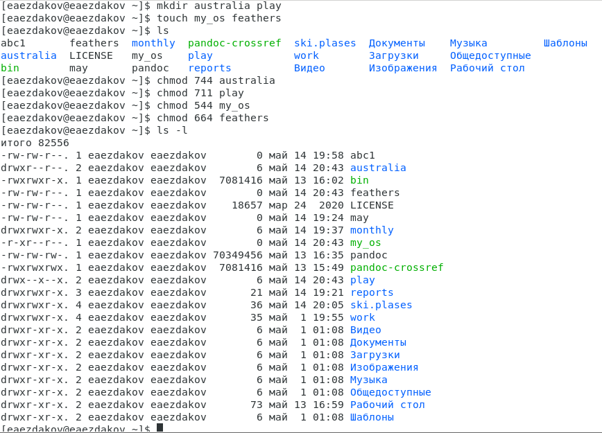

---
## Front matter
lang: ru-RU
title: Отчёт по лабораторной работе №6
author: Ездаков Егор Андреевич
institute: РУДН, Москва, Россия
date: 14 мая 2021

## Formatting
toc: false
slide_level: 2
theme: metropolis
header-includes: 
 - \metroset{progressbar=frametitle,sectionpage=progressbar,numbering=fraction}
 - '\makeatletter'
 - '\beamer@ignorenonframefalse'
 - '\makeatother'
aspectratio: 43
section-titles: true
---

## Цель работы

Ознакомление с файловой системой Linux, её структурой, именами и содержанием каталогов. Приобретение практических навыков по применению команд для работы с файлами и каталогами, по управлению процессами (и работами), по проверке использования диска и обслуживанию файловой системы.

## Копирование файлов и каталогов

Копирование фалйов и каталогов осуществляется командой cp
Можно копировать несколько каталогов добавив нелсколько аргументов в команду
Чтобы скопировать каталог содержащий файлы необходимо использовать команду cp с опцией r

{ #fig:001 width=70% }

## Перемещение и переименование файлов и каталогов
Переименование файлов  
Перемещение файлов в каталог  
Перемещение каталога в другой каталог  
Переименование каталога не являющегося текущим

{ #fig:002 width=70% }

## Права доступа

Команда chmod + - r w x  
Права доступа для владельца, членов группы, всех остальных  
Цифровая запись прав доступа

{ #fig:003 width=70% }
{ #fig:004 width=70% }

## Вывод

В ходе выполнения данной лабораторной работы я ознакомился с файловой системой Linux, её структурой, именами и содержанием каталогов, получил навыки по применению команд для работы с файлами и каталогами, по управлению процессами (и работами), по проверке использования диска и обслуживанию файловой системы.

## {.standout}

Спасибо за внимание!