---
# Front matter
lang: ru-RU
title: "Отчёт по лабораторной работе №6"
subtitle: "Дисциплина: Операционные системы"
author: "Ездаков Егор Андреевич"

# Formatting
toc-title: "Содержание"
toc: true # Table of contents
toc_depth: 2
lof: true # List of figures
lot: true # List of tables
fontsize: 12pt
linestretch: 1.5
papersize: a4paper
documentclass: scrreprt
polyglossia-lang: russian
polyglossia-otherlangs: english
mainfont: PT Serif
romanfont: PT Serif
sansfont: PT Sans
monofont: PT Mono
mainfontoptions: Ligatures=TeX
romanfontoptions: Ligatures=TeX
sansfontoptions: Ligatures=TeX,Scale=MatchLowercase
monofontoptions: Scale=MatchLowercase
indent: true
pdf-engine: lualatex
header-includes:
  - \linepenalty=10 # the penalty added to the badness of each line within a paragraph (no associated penalty node) Increasing the value makes tex try to have fewer lines in the paragraph.
  - \interlinepenalty=0 # value of the penalty (node) added after each line of a paragraph.
  - \hyphenpenalty=50 # the penalty for line breaking at an automatically inserted hyphen
  - \exhyphenpenalty=50 # the penalty for line breaking at an explicit hyphen
  - \binoppenalty=700 # the penalty for breaking a line at a binary operator
  - \relpenalty=500 # the penalty for breaking a line at a relation
  - \clubpenalty=150 # extra penalty for breaking after first line of a paragraph
  - \widowpenalty=150 # extra penalty for breaking before last line of a paragraph
  - \displaywidowpenalty=50 # extra penalty for breaking before last line before a display math
  - \brokenpenalty=100 # extra penalty for page breaking after a hyphenated line
  - \predisplaypenalty=10000 # penalty for breaking before a display
  - \postdisplaypenalty=0 # penalty for breaking after a display
  - \floatingpenalty = 20000 # penalty for splitting an insertion (can only be split footnote in standard LaTeX)
  - \raggedbottom # or \flushbottom
  - \usepackage{float} # keep figures where there are in the text
  - \floatplacement{figure}{H} # keep figures where there are in the text
---

# Цель работы

Ознакомление с файловой системой Linux, её структурой, именами и содержанием каталогов. Приобретение практических навыков по применению команд для работы с файлами и каталогами, по управлению процессами (и работами), по проверке использования диска и обслуживанию файловой системы.

# Задание

1. Выполните все примеры, приведённые в первой части описания лабораторной работы.
2. Выполните следующие действия, зафиксировав в отчёте по лабораторной работе используемые при этом команды и результаты их выполнения:
   1. Скопируйте файл /usr/include/sys/io.h в домашний каталог и назовите его equipment. Если файла io.h нет, то используйте любой другой файл в каталоге /usr/include/sys/ вместо него.
   2. В домашнем каталоге создайте директорию ~/ski.plases.
   3. Переместите файл equipment в каталог ~/ski.plases.
   4. Переименуйте файл ~/ski.plases/equipment в ~/ski.plases/equiplist.
   5. Создайте в домашнем каталоге файл abc1 и скопируйте его в каталог ~/ski.plases, назовите его equiplist2.
   6. Создайте каталог с именем equipment в каталоге ~/ski.plases.
   7. Переместите файлы ~/ski.plases/equiplist и equiplist2 в каталог ~/ski.plases/equipment.
   8. Создайте и переместите каталог ~/newdir в каталог ~/ski.plases и назовите его plans.
3. Определите опции команды chmod, необходимые для того, чтобы присвоить перечисленным ниже файлам выделенные права доступа, считая, что в начале таких прав нет:
  1. drwxr--r-- ... australia
  2. drwx--x--x ... play
  3. -r-xr--r-- ... my_os
  4. -rw-rw-r-- ... feathers  
  При необходимости создайте нужные файлы.
4. Проделайте приведённые ниже упражнения, записывая в отчёт по лабораторной работе используемые при этом команды:
   1. Просмотрите содержимое файла /etc/password.
   2. Скопируйте файл ~/feathers в файл ~/file.old.
   3. Переместите файл ~/file.old в каталог ~/play.
   4. Скопируйте каталог ~/play в каталог ~/fun.
   5. Переместите каталог ~/fun в каталог ~/play и назовите его games.
   6. Лишите владельца файла ~/feathers права на чтение.
   7. Что произойдёт, если вы попытаетесь просмотреть файл ~/feathers командой cat?
   8. Что произойдёт, если вы попытаетесь скопировать файл ~/feathers?
   9. Дайте владельцу файла ~/feathers право на чтение.
   10. Лишите владельца каталога ~/play права на выполнение.
   11. Перейдите в каталог ~/play. Что произошло?
   12. Дайте владельцу каталога ~/play право на выполнение.
5. Прочитайте man по командам mount, fsck, mkfs, kill и кратко их охарактеризуйте, приведя примеры.

# Выполнение лабораторной работы

1. Выполним примеры, описанные в первой части описания лабораторной работы (рис. -@fig:001):
   1. Скопируем файл ~/abc1 в файл april и в файл may. Для этого создадим файл abc1, используя команду «touch abc1», далее осуществим копирование с помощью команд «cp abc1 april» и «cp abc1 may».
   2. Скопируем файлы april и may в каталог monthly, используя команды «mkdir monthly» − для создания каталога monthly и «cp april may monthly» − для копирования.
   3. Скопируем файл monthly/may в файл с именем june. Выполним команды «cp monthly/may monthly/june» и «ls monthly» (для просмотра содержимого каталога).
   4. Скопируем каталог monthly в каталог monthly.00. Для этого создадим каталог monthly.00 командой «mkdir monthly.00» и осуществим копирование, используя команду «cp -r monthly monthly.00» (команда cp с опцией r (recursive) позволяет копировать каталоги вместе с входящими в них файлами и каталогами).
   5. Скопируем каталог monthly.00 в каталог /tmp, используя команду «cp -r monthly.00 /tmp».

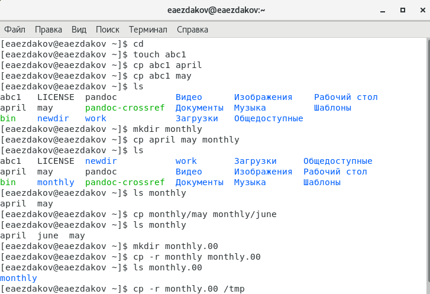{ #fig:001 }

(рис. -@fig:002):

   1. Изменим название файла april на july в домашнем каталоге, используя команду «mv april july».
   2. Переместим файл july в каталог monthly.00 с помощью команды «mv july monthly.00». Проверим результат командой «ls monthly.00».
   3. Переименуем каталог monthly.00 в monthly.01, используя команду «mv monthly.00 monthly.01».
   4. Переместим каталог monthly.01 в каталог reports. Для этого создадим каталог reports с помощью команды «mkdir reports» и выполним перемещение командой «mv monthly.01 reports».
   5. Переименуем каталог reports/monthly.01 в reports/monthly командой
«mv reports/monthly.01 reports/monthly».

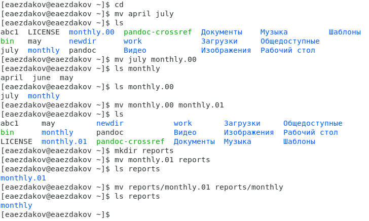{ #fig:002 }

(рис. -@fig:003) (рис. -@fig:004):

   1. Создадим файл ~/may с правом выполнения для владельца. Для этого выполним следующие команды: «touch may» (создание файла), «ls -l may» (просмотр сведений о файле), «chmod u+x may» (изменение прав), «ls -l may».
   2. Лишаем владельца файла ~/may права на выполнение, используя команды: «chmod u-x may» (изменение прав), «ls -l may» (просмотр сведений о файле).
   3. Создаем каталог monthly с запретом на чтение для членов группы и всех остальных пользователей. Выполняем команды: «mkdir monthly» (создание каталога), «chmod go-r monthly» (изменение прав).
   4. Создаем файл ~/abc1 с правом записи для членов группы, используя команды: «touch abc1» (создание файла), «chmod g+w abc1» (изменение прав).

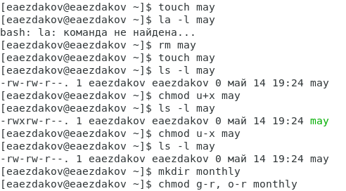{ #fig:003 }

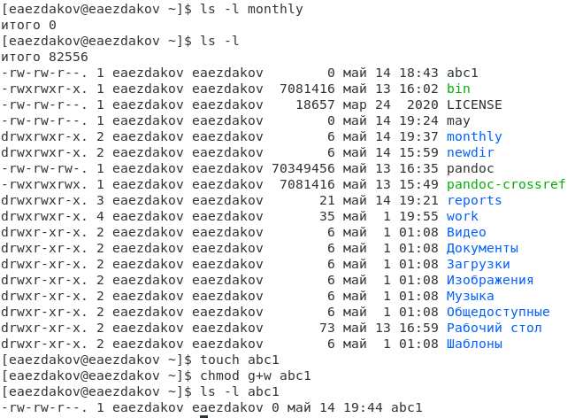{ #fig:004 }

2. Выполняем следующие действия, отображенные на (рис. -@fig:005) (рис. -@fig:006) (рис. -@fig:007):
   1. Копируем файл /usr/include/aio.h (т.к. у меня нет каталога /usr/include/sys/, то беру  произвольный файл из каталога /usr/include/) в домашний каталог (команда «cp /usr/include/aio.h ~») и назоваем его equipment (команда «mv aio.h equipment»).
   2. В домашнем каталоге создаем директорию ~/ski.plases (команда «mkdir ski.plases»).
   3. Перемещаем файл equipment в каталог ~/ski.plases (команда «mv equipment ski.plases»).
   4. Переименовываем файл ~/ski.plases/equipment в ~/ski.plases/equiplist (команда «mv ski.plases/equipment ski.plases/equiplist»).
   5. Создаем в домашнем каталоге файл abc1 (команда «touch abc1») и копируем его в каталог ~/ski.plases (команда «cp abc1 ski.plases»), называем его equiplist2 (команда «mv ski.plases/abc1 ski.plases/equiplist2»).
   6. Создаем каталог с именем equipment в каталоге ~/ski.plases (команда «mkdir ski.plases/equipment»).
   7. Перемещаем файлы ~/ski.plases/equiplist и equiplist2 в каталог ~/ski.plases/equipment (команда «mv ski.plases/equiolist ski.plases/equiplist2 ski.plases/equipment»).
   8. Создаем (команда «mkdir newdir») и перемещаем каталог ~/newdir в каталог ~/ski.plases (команда «mv newdir ski.plases») и называем его plans (команда «mv ski.plases/newdir ski.plases/plans»).

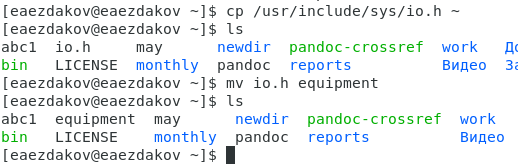{ #fig:005 }

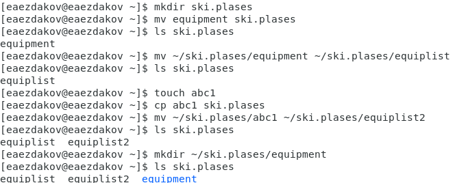{ #fig:006 }

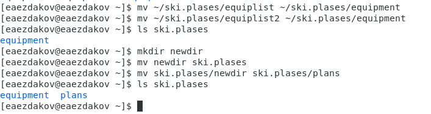{ #fig:007 }

3. Определяем опции команды chmod, необходимые для того, чтобы присвоить соответствующим файлам выделенные права доступа, считая, что в начале таких прав нет. Предварительно создаем необходимые файлы, используя команды: «mkdir australia play», «touch my_os feathers».
- drwxr--r-- ... australia: команда «chmod 744 australia» (это каталог, владелец имеет право на чтение, запись и выполнение, группа владельца и остальные – только чтение)
- drwx--x--x ... play: команда «chmod 711 play» (это каталог, владелец имеет право на чтение, запись и выполнение, группа владельца и остальные – только выполнение)
- -r-xr--r-- ... my_os: команда «chmod 544 my_os» (это файл, владелец имеет право на чтение и выполнение, группа владельца и остальные – только чтение)
- -rw-rw-r-- ... feathers: команда «chmod 664 feathers» (это файл,владелец и группа владельца имеют право на чтение и запись, остальные – только чтение)  
Командой «ls -l» проверяем правильность выполненных действий (рис. -@fig:008).

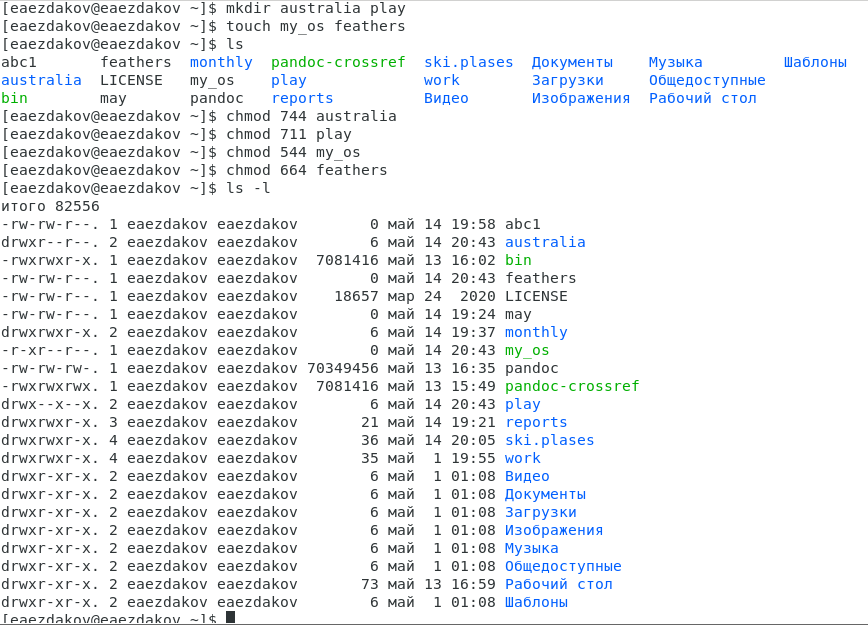{ #fig:008 }

4. Выполняем следующие действия, отображенные на (рис. -@fig:009) (рис. -@fig:010) (рис. -@fig:011):
   1. Просмотрим содержимое файла /etc/passwd (команда «cat /etc/passwd»).
   2. Копируем файл ~/feathers в файл ~/file.old (команда «cp feathers file.old»).
   3. Переместим файл ~/file.old в каталог ~/play (команда «mv file.ord play»).
   4. Скопируем каталог ~/play в каталог ~/fun (команда «cp -r play fun»).
   5. Переместим каталог ~/fun в каталог ~/play (команда «mv fun play») и назовем его games (команда «mv play/fun play/games»).
   6. Лишим владельца файла ~/feathers права на чтение (команда «chmodu-r feathers»).
   7. Если мы попытаемся просмотреть файл ~/feathers командой cat, то получим отказ в доступе, т.к. в предыдущем пункте лишили владельца права на чтение данного файла.
   8. Если мы попытаемся скопировать файл ~/feathers, например, в каталог monthly, то получим отказ в доступе, по причине, описанной в предыдущем пункте.
   9. Дадим владельцу файла ~/feathers право на чтение (команда «chmod u+r feathers»).
   10. Лишим владельца каталога ~/play права на выполнение (команда «chmod u-x play»).
   11. Перейдем в каталог ~/play (команда «cd play»). Получим отказ в доступе, т.к. в предыдущем пункте лишили владельца права на выполнение данного каталога.
   12. Дадим владельцу каталога ~/play право на выполнение (команда «chmod u+x play»).

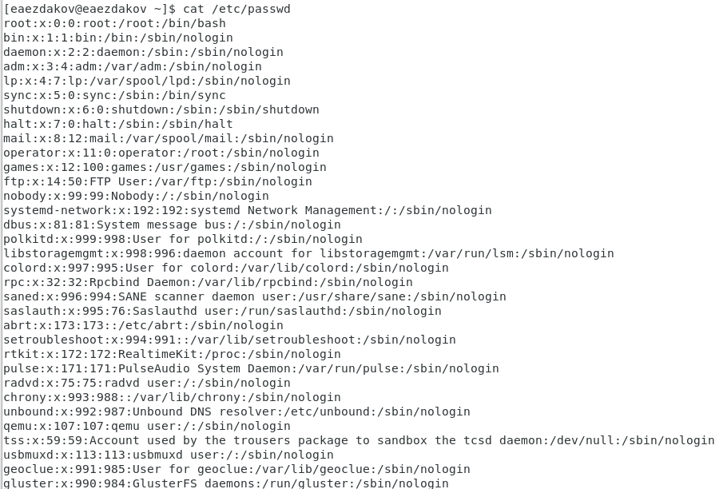{ #fig:009 }

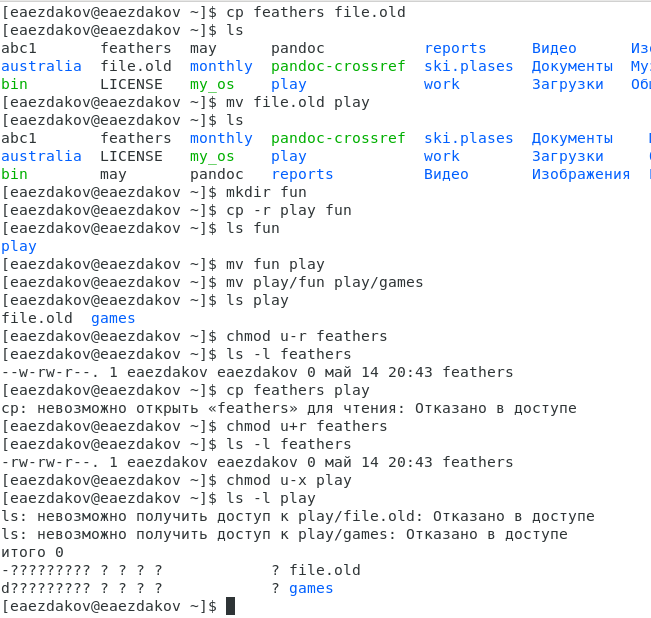{ #fig:010 }

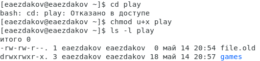{ #fig:011 }

5. Используя команды «man mount», «man fsck», «man mkfs», «man kill», получим информацию о соответствующих командах.

Команда mount (рис. -@fig:012):  
Предназначена для монтирования файловой системы. Все файлы, доступные в Unix системах, составляют иерархическую файловую структуру, которая имеет ветки (каталоги) и листья (файлы в каталогах). Корень этого дерева обозначается как /. Физически файлы могут располагаться на различных устройствах. Команда mount служит для подключения файловых систем разных устройств к этому большому дереву.  
Наиболее часто встречающаяся форма команды mount выглядит следующим образом:  
«mount -t vfstype device dir»  
Такая команда предлагает ядру смонтировать (подключить) файловую систему указанного типа vfstype, расположенную на устройстве device, к заданному каталогу dir, который часто называют точкой монтирования.

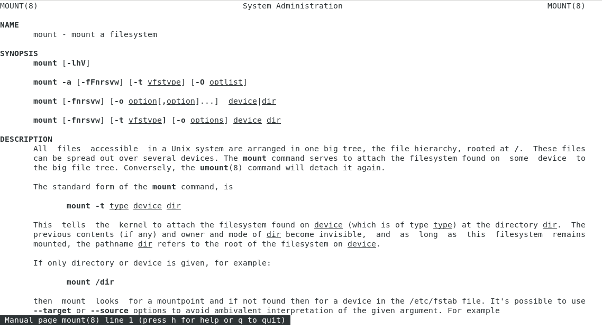{ #fig:012 }

Команда fsck (рис. -@fig:013):  
Это утилита командной строки, которая позволяет выполнять проверки согласованности и интерактивное исправление в одной или нескольких файловых системах Linux. Он использует программы, специфичные для типа файловой системы, которую он проверяет.  
У команды fsck следующий синтаксис:  
fsck параметр -- параметры ФС <файловая система> . . .  
Например, если нужно восстановить («починить») файловую систему на некотором устройстве /dev/sdb2, следует воспользоваться командой:  
«sudo fsck -y /dev/sdb2»  
Опция -y необходима, т. к. при её отсутствии придётся слишком часто давать подтверждение.

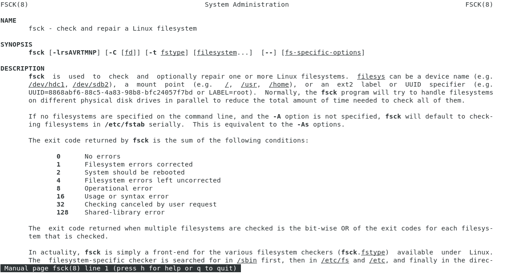{ #fig:013 }

Команда mkfs (рис. -@fig:014):  
Создаёт новую файловую систему Linux.  
Имеет следующий синтаксис:  
mkfs -V -t fstype fs-options filesys blocks  
mkfs используется для создания файловой системы Linux на некотором устройстве, обычно в разделе жёсткого диска. В качестве аргумента filesys для файловой системы может выступать или название устройства (например, /dev/hda1, /dev/sdb2) или точка монтирования (например, /, /usr, /home).  
Аргументом blocks указывается количество блоков, которые выделяются для использования этой файловой системой.  
По окончании работы mkfs возвращает 0 - в случае успеха, а 1 - при неудачной операции.  
Например, команда «mkfs -t ext2 /dev/hdb1» создаёт файловую систему типа ext2 в разделе /dev/hdb1 (второй жёсткий диск).

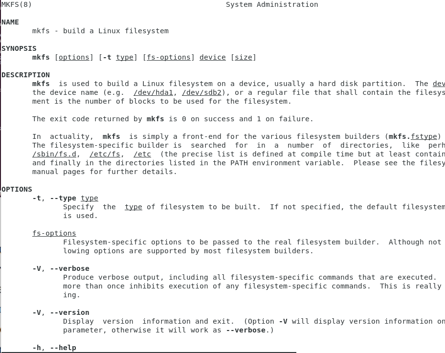{ #fig:014 }

Команда kill (рис. -@fig:015):  
Посылает сигнал процессу или выводит список допустимых сигналов.  
Имеет следующий синтаксис:  
kill опции PID, где PID – это PID (числовой идентификатор) процесса или несколько PID процессов, если требуется послать сигнал сразу нескольким процессам.  
Например, команда «kill -KILL 3121» посылает сигнал KILL процессу с PID 3121, чтобы принудительно завершить процесс.

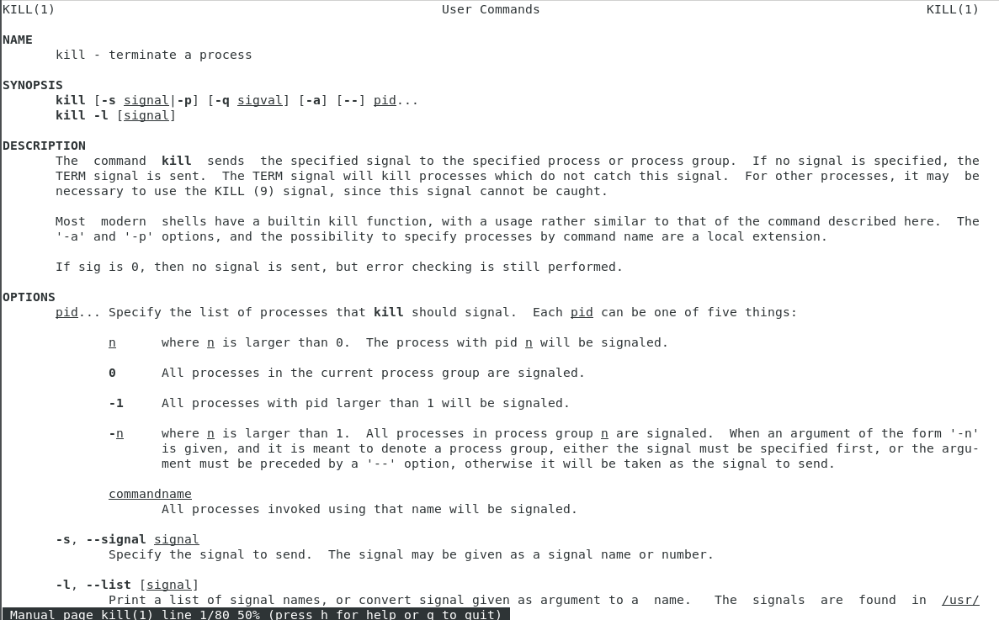{ #fig:015 }

# Выводы

В ходе выполнения данной лабораторной работы я ознакомился с файловой системой Linux, её структурой, именами и содержанием каталогов, получил навыки по применению команд для работы с файлами и каталогами, по управлению процессами (и работами), по проверке использования диска и обслуживанию файловой системы.

