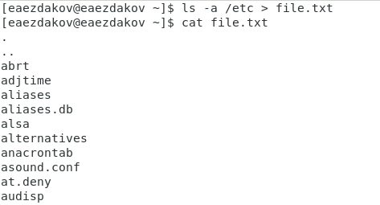
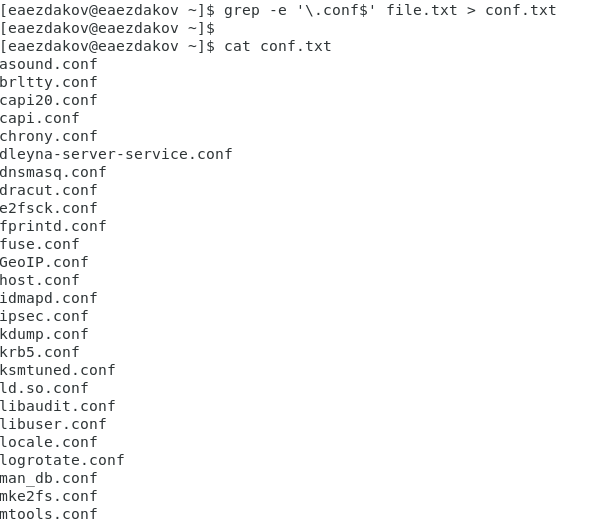
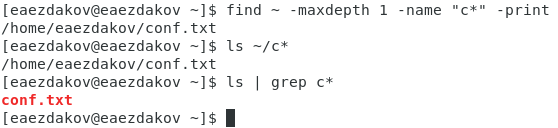
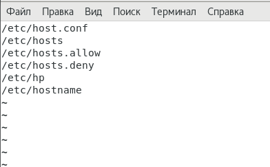
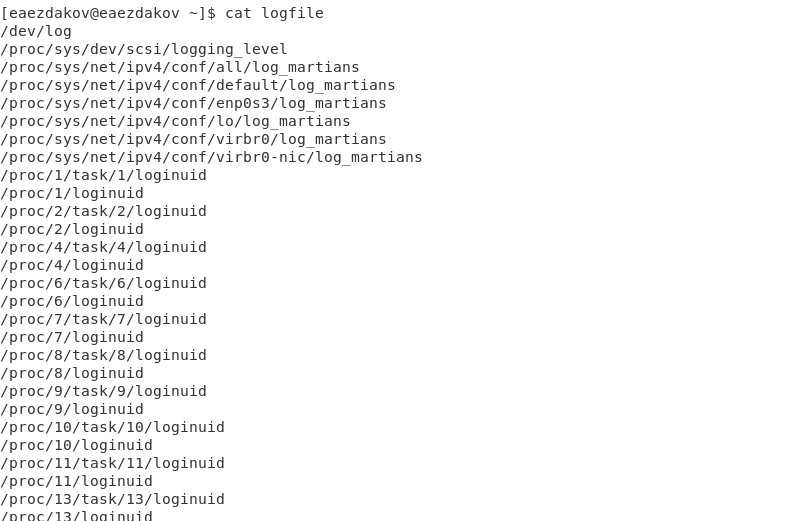
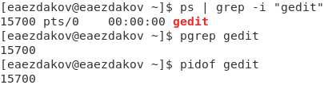
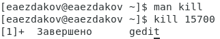

---
## Front matter
lang: ru-RU
title: Отчёт по лабораторной работе №7
author: Ездаков Егор Андреевич
institute: РУДН, Москва, Россия
date: 14 мая 2021

## Formatting
toc: false
slide_level: 2
theme: metropolis
header-includes: 
 - \metroset{progressbar=frametitle,sectionpage=progressbar,numbering=fraction}
 - '\makeatletter'
 - '\beamer@ignorenonframefalse'
 - '\makeatother'
aspectratio: 43
section-titles: true
---

## Цель работы

Ознакомление с инструментами поиска файлов и фильтрации текстовых данных. Приобретение практических навыков: по управлению процессами (и заданиями), по проверке использования диска и обслуживанию файловых систем.

## Записываем названия файлов, содержащихся в каталоге /etc

Используя команду «ls –a /etc > file.txt» записываю в файл file.txt названия файлов, содержащихся в каталоге /etc,  (рис. -@fig:001).

{ #fig:001 width=70% }

## Файлы с расширением .conf

Записываю  имена  файлов из file.txt, имеющих расширение .conf в файл conf.txt используя команду «grep -e ‘\.conf$’ file.txt > conf.txt» (рис. -@fig:002).

{ #fig:002 width=70% }

## Определяем, какие файлы начинаются с символа c

Чтобы определить какие файлы в домашнем каталоге начинаются с символа с и вывести их ипользую команду: «find ~ -maxdepth 1 -name “c*” -print» (рис. -@fig:003).

{ #fig:003 width=70% }

## Файлы, начинающиеся с символа h, вывод постранично

Чтобы вывести на экран (постранично) имена файлов из каталога /etc, начинающиеся с символа h, воспользуемся командой «find /etc –maxdepth 1 –name “h*” | less» (рис. -@fig:004).

{ #fig:004 width=70% }

## Запись файлов через фоновый процесс

Использую команду «find / -name “log*” > logfile &» чтобы запустить процесс в фоновим режиме, который будет записывать в ~/logfile файлы, имена которых начинаются с log.(рис. -@fig:005).

{ #fig:005 width=70% }

## Идентификатор процесса

Чтобы определить идентификатор процесса gedit, использую команду «ps | grep -i “gedit”». Процесс имеет идентификатор 15700 (рис. -@fig:006).

{ #fig:006 width=70% }

## Используем kill для завершения процесса gedit

Использую команду kill для завершения процесса gedit (команда «kill 15700») (рис. -@fig:007).

{ #fig:007 width=70% }

## Вывод

В ходе выполнения данной лабораторной работы я изучил инструменты поиска файлов и фильтрации текстовых данных, а также
приобрёл практические навыки: по управлению процессами (и заданиями), по проверке использования диска и обслуживанию файловых систем.

## {.standout}

Спасибо за внимание!