---
# Front matter
lang: ru-RU
title: "Отчёт по лабораторной работе №7"
subtitle: "Дисциплина: Операционные системы"
author: "Ездаков Егор Андреевич"

# Formatting
toc-title: "Содержание"
toc: true # Table of contents
toc_depth: 2
lof: true # List of figures
lot: true # List of tables
fontsize: 12pt
linestretch: 1.5
papersize: a4paper
documentclass: scrreprt
polyglossia-lang: russian
polyglossia-otherlangs: english
mainfont: PT Serif
romanfont: PT Serif
sansfont: PT Sans
monofont: PT Mono
mainfontoptions: Ligatures=TeX
romanfontoptions: Ligatures=TeX
sansfontoptions: Ligatures=TeX,Scale=MatchLowercase
monofontoptions: Scale=MatchLowercase
indent: true
pdf-engine: lualatex
header-includes:
  - \linepenalty=10 # the penalty added to the badness of each line within a paragraph (no associated penalty node) Increasing the value makes tex try to have fewer lines in the paragraph.
  - \interlinepenalty=0 # value of the penalty (node) added after each line of a paragraph.
  - \hyphenpenalty=50 # the penalty for line breaking at an automatically inserted hyphen
  - \exhyphenpenalty=50 # the penalty for line breaking at an explicit hyphen
  - \binoppenalty=700 # the penalty for breaking a line at a binary operator
  - \relpenalty=500 # the penalty for breaking a line at a relation
  - \clubpenalty=150 # extra penalty for breaking after first line of a paragraph
  - \widowpenalty=150 # extra penalty for breaking before last line of a paragraph
  - \displaywidowpenalty=50 # extra penalty for breaking before last line before a display math
  - \brokenpenalty=100 # extra penalty for page breaking after a hyphenated line
  - \predisplaypenalty=10000 # penalty for breaking before a display
  - \postdisplaypenalty=0 # penalty for breaking after a display
  - \floatingpenalty = 20000 # penalty for splitting an insertion (can only be split footnote in standard LaTeX)
  - \raggedbottom # or \flushbottom
  - \usepackage{float} # keep figures where there are in the text
  - \floatplacement{figure}{H} # keep figures where there are in the text
---

# Цель работы

Ознакомление с инструментами поиска файлов и фильтрации текстовых данных. Приобретение практических навыков: по управлению процессами (и заданиями), по проверке использования диска и обслуживанию файловых систем.

# Задание

1. Осуществите вход в систему, используя соответствующее имя пользователя.
2. Запишите в файл file.txt названия файлов, содержащихся в каталоге /etc. Допишите в этот же файл названия файлов, содержащихся в вашем домашнем каталоге.
3. Выведите имена всех файлов из file.txt, имеющих расширение .conf, после чего запишите их в новый текстовой файл conf.txt.
4. Определите, какие файлы в вашем домашнем каталоге имеют имена, начинавшиеся с символа c? Предложите несколько вариантов, как это сделать.
5. Выведите на экран (постранично) имена файлов из каталога /etc , начинающиеся с символа h.
6. Запустите в фоновом режиме процесс, который будет записывать в файл ~/logfile файлы, имена которых начинаются с log.
7. Удалите файл ~/logfile.
8. Запустите из консоли в фоновом режиме редактор gedit.
9. Определите идентификатор процесса gedit, используя команду ps, конвейер и фильтр grep. Можно ли определить этот идентификатор более простым способом?
10. Прочтите справку (man) команды kill, после чего используйте её для завершения процесса gedit.
11. Выполните команды df и du, предварительно получив более подробную информацию об этих командах, с помощью команды man.
12. Воспользовавшись справкой команды find, выведите имена всех директорий, имеющихся в вашем домашнем каталоге.

# Выполнение лабораторной работы

1. Осуществляю вход в систему, используя соответствующее имя пользователя/
2. Записываю в файл file.txt названия файлов, содержащихся в каталоге /etc, используя команду «ls –a /etc > file.txt» (рис. -@fig:001). Далее с помощью команды «ls -a ~ >> file.txt» дописываю в этот же файл названия файлов, содержащихся в моем домашнем каталоге (рис. -@fig:002). Командой «cat file.txt» проверяю правильность выполненных действий (рис. -@fig:003).

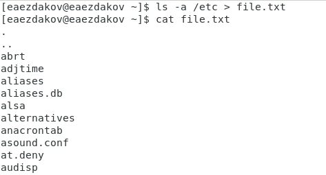{ #fig:001 }

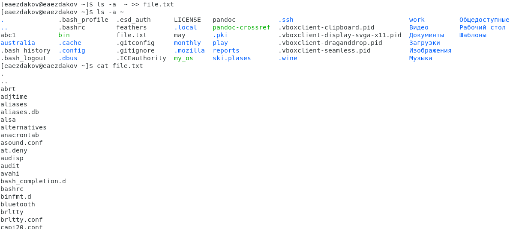{ #fig:002 }

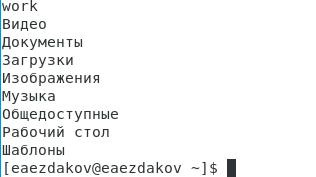{ #fig:003 }

3. Вывожу имена всех файлов из file.txt, имеющих расширение .conf и записываю их в новый текстовой файл conf.txt с помощью команды «grep -e ‘\.conf$’ file.txt > conf.txt». Командой «cat conf.txt» проверяю правильность выполненных действий (рис. -@fig:004).

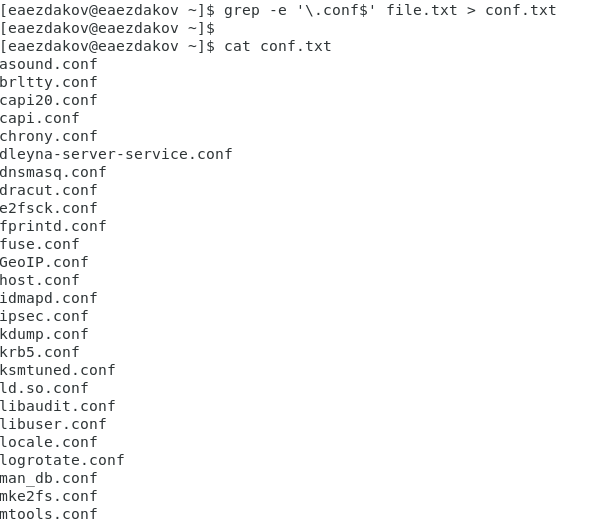{ #fig:004 }

4. Определяю, какие файлы в моем домашнем каталоге имеют имена, начинающиеся с символа c, с помощью команды: «find ~ -maxdepth 1 -name “c*” -print» (опция maxdepth 1 необходима для того, чтобы файлы находились только в домашнем каталоге (не в его подкаталогах)), другие команды с помощью которых это можно сделать: «ls ~/c*» и «ls –a ~ | grep c*» (рис. -@fig:005).

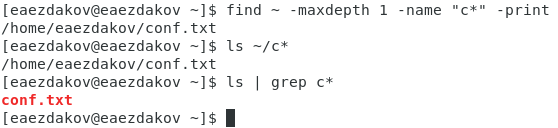{ #fig:005 }

5. Вывожу на экран постранично имена файлов из каталога /etc, начинающиеся с символа h, используя команду «find /etc –maxdepth 1 –name “h*” | less» (рис. -@fig:006).

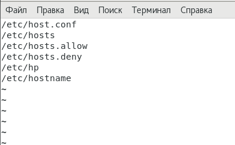{ #fig:006 }

6. Запускаю в фоновом режиме процесс, который будет записывать в файл ~/logfile файлы, имена которых начинаются с log, используя команду «find / -name “log*” > logfile &» (рис. -@fig:007). Командой «cat logfile» проверяю выполненные действия (рис. -@fig:008).

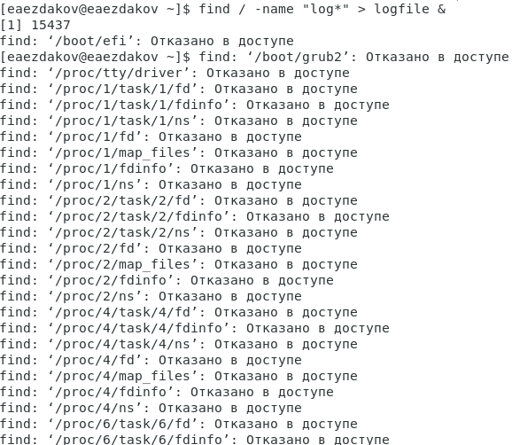{ #fig:007 }

7. Удаляю файл ~/logfile командой «rm logfile».

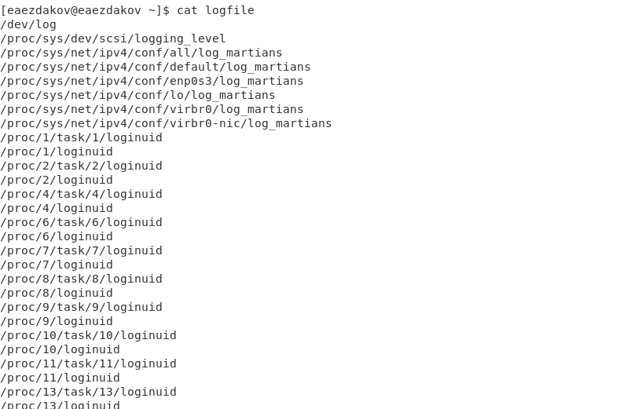{ #fig:008 }

8. Запускаю редактор gedit в фоновом режиме командой «gedit &» (рис. -@fig:009).

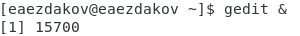{ #fig:009 }

9. Чтобы определить идентификатор процесса gedit, использую команду «ps | grep -i “gedit”». Процесс имеет идентификатор 15700. Можно узнать идентификатор более простым способом, используя команду «pgrep gedit» или «pidof gedit» (рис. -@fig:010).

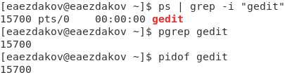{ #fig:010 }

10. Прочитав справку команды kill с помощью команды «man kill», использую её для завершения процесса gedit (команда «kill 15700») (рис. -@fig:011) (рис. -@fig:012).

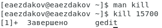{ #fig:011 }

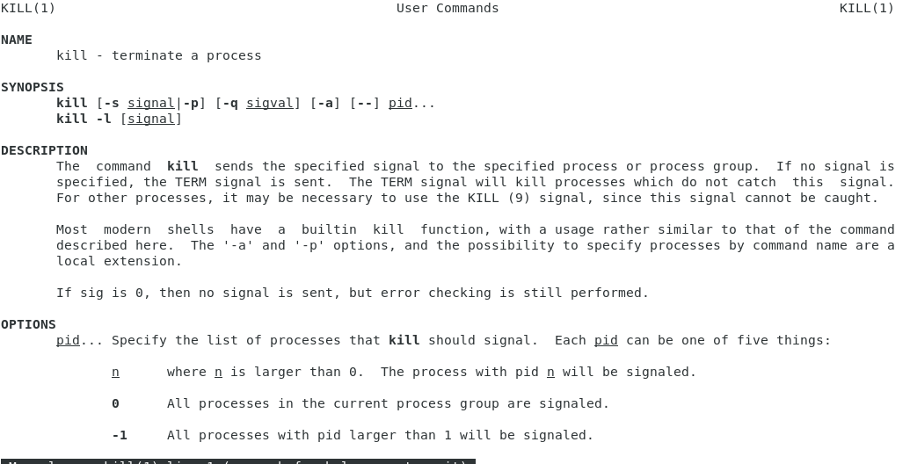{ #fig:012 }

11. C помощью команд «man df» (рис. -@fig:013) и «man du» (рис. -@fig:014) узнаю информацию об этих командах и выполняю их (рис. -@fig:015).  
df – утилита, показывающая список всех файловых систем по именам устройств, сообщает их размер, занятое и свободное пространство и точки монтирования.  
Синтаксис: df опции устройство  
du – утилита, предназначенная для вывода информации об объеме дискового пространства, занятого файлами и директориями. Она принимает путь к элементу файловой системы и выводит информацию о количестве байт дискового пространства или блоков диска, задействованных для его хранения.  
Синтаксис: du опции каталог_или_файл

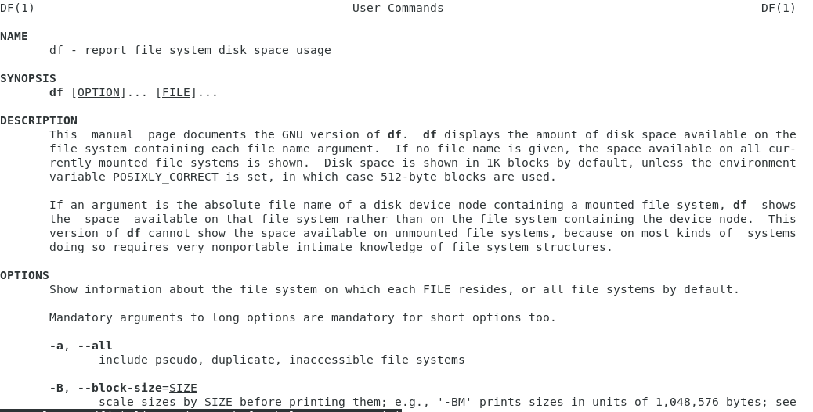{ #fig:013 }

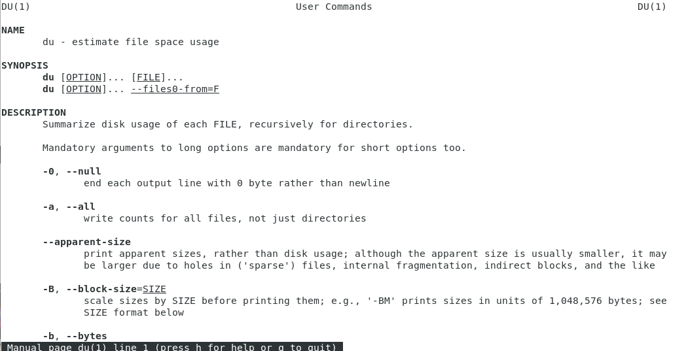{ #fig:014 }

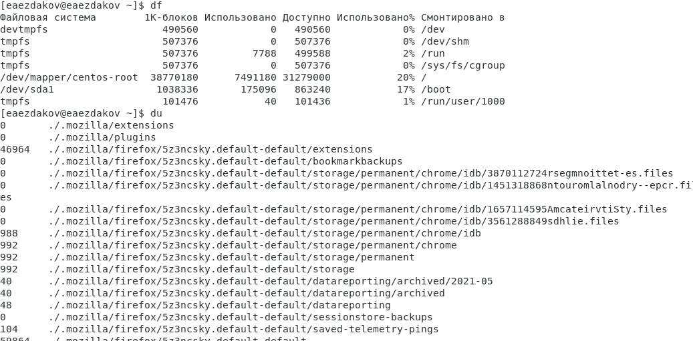{ #fig:015 }

12. Получаем информацию с помощью команды «man find» (рис. -@fig:016) и выводим имена всех директорий, имеющихся в домашнем каталоге с помощью команды «find ~ -type d» (рис. -@fig:017).

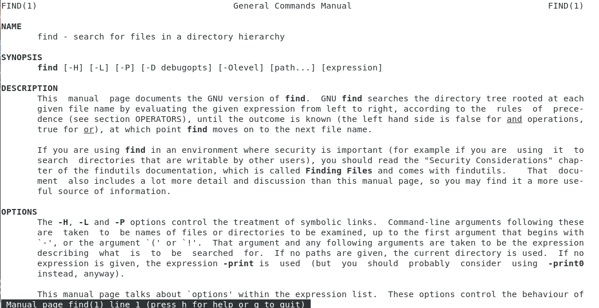{ #fig:016 }

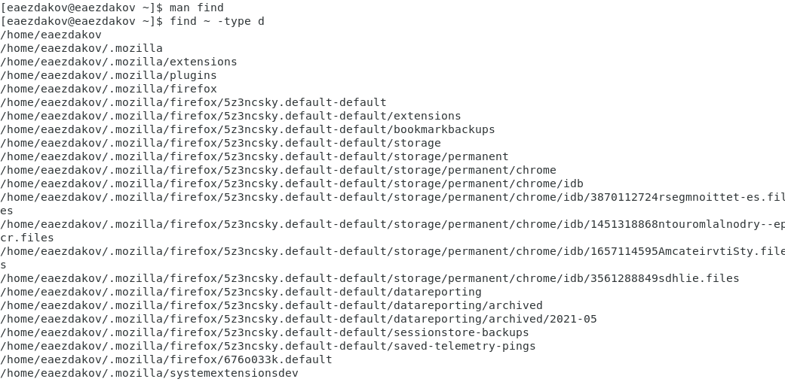{ #fig:017 }

# Выводы

В ходе выполнения данной лабораторной работы я изучил инструменты поиска файлов и фильтрации текстовых данных, а также
приобрёл практические навыки: по управлению процессами (и заданиями), по проверке использования диска и обслуживанию файловых систем.

