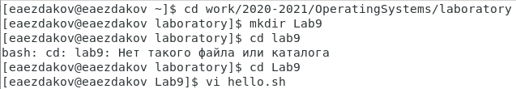
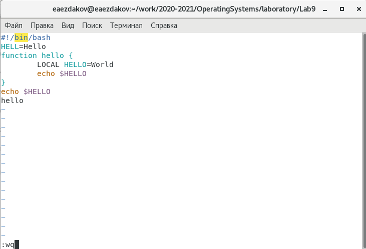
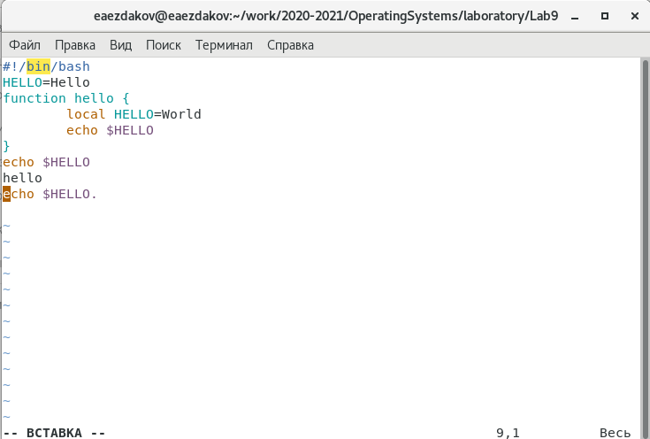

---
## Front matter
lang: ru-RU
title: Отчёт по лабораторной работе №9
author: Ездаков Егор Андреевич
institute: РУДН, Москва, Россия
date: 14 мая 2021

## Formatting
toc: false
slide_level: 2
theme: metropolis
header-includes: 
 - \metroset{progressbar=frametitle,sectionpage=progressbar,numbering=fraction}
 - '\makeatletter'
 - '\beamer@ignorenonframefalse'
 - '\makeatother'
aspectratio: 43
section-titles: true
---

## Цель работы

Познакомиться с операционной системой Linux. Получить практические навыки работы с редактором vi, установленным по умолчанию практически во всех дистрибутивах.

## Вызываем vi и создаем файл hello.sh

Задание 1: Вызываем vi и создаем файл hello.sh с помощью команды «vi hello.sh» (рис. -@fig:001).

{ #fig:001 width=70% }

## Нажимаем клавишу «i» и вводим текст

Нажимаем клавишу «i» и вводим текст, указанный в лабораторной работе (рис. -@fig:002).

{ #fig:002 width=70% }

## Делаем файл исполняемым

Чтобы сделать файл исполняемым, используем команду «chmod +x hello.sh» (рис. -@fig:003).

{ #fig:003 width=70% }

## Вызовем vi для редактирования файла

Задание 2: Вызовем vi для редактирования файла с помощью команды «vi ~/work/2020-2021/OperatingSystems/laboratory/lab09/hello.sh» (рис. -@fig:004).

{ #fig:004 width=70% }

## Вызовем vi для редактирования файла

Удаляем последнюю строку, используя комбинацию клавиш «d» и «d». Введем команду отмены изменений «u» для отмены последней команды (рис. -@fig:005).

{ #fig:005 width=70% }

## Вывод

В ходе выполнения данной лабораторной работы я познакомился с операционной системой Linux и получил практические навыки работы с редактором vi.

## {.standout}

Спасибо за внимание!