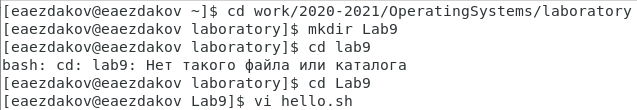
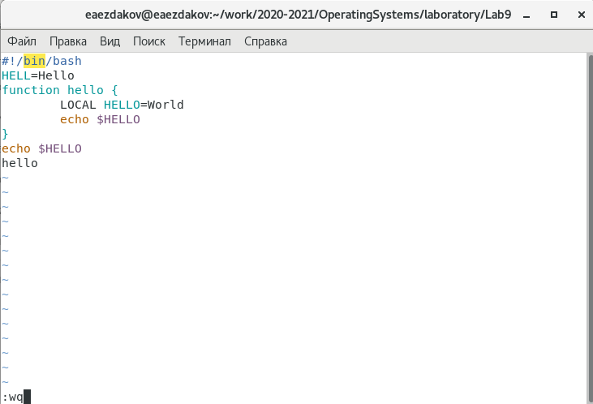
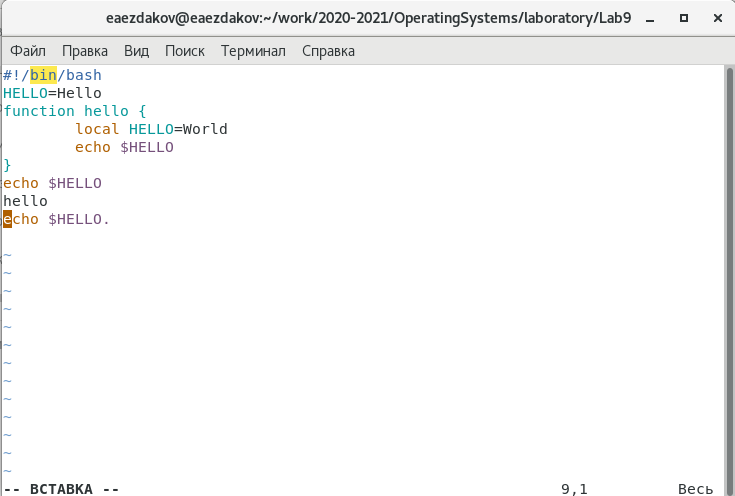
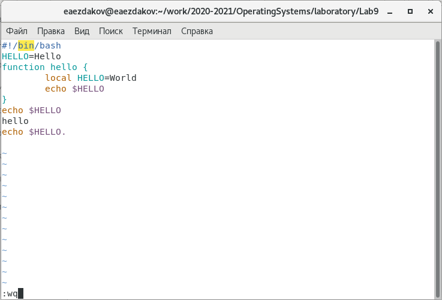

---
# Front matter
lang: ru-RU
title: "Отчёт по лабораторной работе №9"
subtitle: "Дисциплина: Операционные системы"
author: "Ездаков Егор Андреевич"

# Formatting
toc-title: "Содержание"
toc: true # Table of contents
toc_depth: 2
lof: true # List of figures
lot: true # List of tables
fontsize: 12pt
linestretch: 1.5
papersize: a4paper
documentclass: scrreprt
polyglossia-lang: russian
polyglossia-otherlangs: english
mainfont: PT Serif
romanfont: PT Serif
sansfont: PT Sans
monofont: PT Mono
mainfontoptions: Ligatures=TeX
romanfontoptions: Ligatures=TeX
sansfontoptions: Ligatures=TeX,Scale=MatchLowercase
monofontoptions: Scale=MatchLowercase
indent: true
pdf-engine: lualatex
header-includes:
  - \linepenalty=10 # the penalty added to the badness of each line within a paragraph (no associated penalty node) Increasing the value makes tex try to have fewer lines in the paragraph.
  - \interlinepenalty=0 # value of the penalty (node) added after each line of a paragraph.
  - \hyphenpenalty=50 # the penalty for line breaking at an automatically inserted hyphen
  - \exhyphenpenalty=50 # the penalty for line breaking at an explicit hyphen
  - \binoppenalty=700 # the penalty for breaking a line at a binary operator
  - \relpenalty=500 # the penalty for breaking a line at a relation
  - \clubpenalty=150 # extra penalty for breaking after first line of a paragraph
  - \widowpenalty=150 # extra penalty for breaking before last line of a paragraph
  - \displaywidowpenalty=50 # extra penalty for breaking before last line before a display math
  - \brokenpenalty=100 # extra penalty for page breaking after a hyphenated line
  - \predisplaypenalty=10000 # penalty for breaking before a display
  - \postdisplaypenalty=0 # penalty for breaking after a display
  - \floatingpenalty = 20000 # penalty for splitting an insertion (can only be split footnote in standard LaTeX)
  - \raggedbottom # or \flushbottom
  - \usepackage{float} # keep figures where there are in the text
  - \floatplacement{figure}{H} # keep figures where there are in the text
---

# Цель работы

Познакомиться с операционной системой Linux. Получить практические навыки работы с редактором vi, установленным по умолчанию практически во всех дистрибутивах.

# Задание 1. Создание нового файла с использованием vi

1. Создайте каталог с именем ~/work/os/lab06 .
2. Перейдите во вновь созданный каталог.
3. Вызовите vi и создайте файл hello.sh (vi hello.sh).
4. Нажмите клавишу i и вводите следующий текст.
5. Нажмите клавишу Esc для перехода в командный режим после завершения ввода текста.
6. Нажмите : для перехода в режим последней строки и внизу вашего экрана появится приглашение в виде двоеточия.
7. Нажмите w (записать) и q (выйти), а затем нажмите клавишу Enter для сохранения вашего текста и завершения работы.
8. Сделайте файл исполняемым chmod +x hello.sh

# Задание 2. Редактирование существующего файла

1. Вызовите vi на редактирование файла vi ~/work/os/lab06/hello.sh
2. Установите курсор в конец слова HELL второй строки.
3. Перейдите в режим вставки и замените на HELLO . Нажмите Esc для возврата в командный режим.
4. Установите курсор на четвертую строку и сотрите слово LOCAL .
5. Перейдите в режим вставки и наберите следующий текст: local , нажмите Esc для возврата в командный режим.
6. Установите курсор на последней строке файла. Вставьте после неё строку, содержащую следующий текст: echo $HELLO .
7. Нажмите Esc для перехода в командный режим.
8. Удалите последнюю строку.
9. Введите команду отмены изменений u для отмены последней команды.
10. Введите символ : для перехода в режим последней строки. Запишите произведённые изменения и выйдите из vi.

# Выполнение лабораторной работы

Задание 1:

1. Создаем в домашней папке каталог work/2020-2021/OperatingSystems/laboratory/lab9, используя команду «mkdir lab9».
2. Командой «cd work/2020-2021/OperatingSystems/laboratory/lab9» переходим в созданный каталог.
3. Вызываем vi и создаем файл hello.sh с помощью команды «vi hello.sh» (рис. -@fig:001).

{ #fig:001 }

4. Нажимаем клавишу «i» и вводим текст, указанный в лабораторной работе (рис. -@fig:002).

{ #fig:002 }

5. Нажимаем клавишу «Esc», чтобы перейти в командный режим после завершения ввода текста.
6. Нажимаем «:» для перехода в режим последней строки и внизу экрана видим, что появилось приглашение в виде двоеточия.
7. Нажимаем «w» (записать) и «q» (выйти), далее нажимаем клавишу «Enter» для сохранения текста и завершения работы.
8. Чтобы сделать файл исполняемым, используем команду «chmod +x hello.sh» (рис. -@fig:003).

{ #fig:003 }

Задание 2:

1. Вызовем vi для редактирования файла с помощью команды «vi ~/work/2020-2021/OperatingSystems/laboratory/lab9/hello.sh».
2. Далее с помощью стрелок установила курсор в конец слова HELL второй строки.
3. Перейдем в режим вставки, нажав на клавишу «i», и заменим HELL на HELLO, дописав O. Нажмем «Esc» для возврата в командный режим.
4. С помощью стрелок установим курсор на четвертую строку и сотрем слово LOCAL с помощью комбинации клавиш «d» (delete) и «w» (word).
5. Перейдем в режим вставки, нажав клавишу «i», и наберем следующий текст: local. Нажмем «Esc» для возврата в командный режим.
6. Установим курсор на последней строке файла, используя стрелки. Вставим после неё строку, содержащую следующий текст: echo $HELLO (рис. -@fig:004).

{ #fig:004 }

7. Далее нажимаем «Esc», чтобы перейти в командный режим.
8. Удаляем последнюю строку, используя комбинацию клавиш «d» и «d».
9. Введем команду отмены изменений «u» для отмены последней команды (рис. -@fig:005).

{ #fig:005 }

10. Введем символ «:» для перехода в режим последней строки. Запишем произведённые изменения, нажав «w» и «q» и выйдем из vi.

# Выводы

В ходе выполнения данной лабораторной работы я познакомился с операционной системой Linux и получил практические навыки работы с редактором vi.

